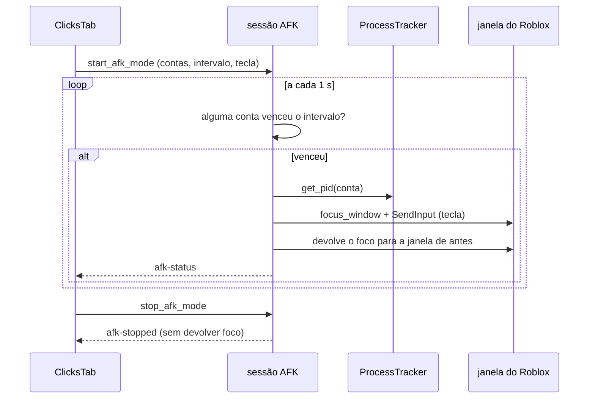

# AFK mode (envio periódico de tecla ou clique)

## Objetivo

Mandar **uma tecla ou um clique, de tempo em tempo**, para a janela do cliente de cada conta que o usuário colocou no modo — para o jogo não contar a conta como parada e **não precisar de rejoin**. O ganho em relação ao Auto Rejoin é o estado: a conta não sai do lugar do mapa, não perde progresso e não reabre cliente nenhum.

**O que não é:** detecção de interação. A API do Windows que diz "quando houve a última entrada" responde pela **sessão inteira** do usuário, nunca por uma janela — não há como perguntar "esta conta está parada?". Por isso o modo é de envio periódico, e só.

**Tecla ou clique** (`Afk.Mode`): toda tecla da lista mexe no personagem (anda, pula, usa item). Quem quer a conta **parada** usa o modo clique — um clique esquerdo num ponto vazio da tela do jogo, que também conta como atividade e não move o personagem. Especificação: [docs/superpowers/specs/2026-09-29-afk-click-design.md](../superpowers/specs/2026-09-29-afk-click-design.md).

**Gravação** (`Afk.Mode = recording`, desde 11/10/2026): em vez de uma tecla ou um clique, cada conta toca a **gravação** dela (a própria ou a de todas as contas) do começo ao fim, a cada intervalo. É o mesmo ciclo — uma janela por vez, foco conferido, devolvido no fim —, com a ação `AfkCycleAction::Recording`. Conta sem gravação é pulada sem a janela vir para frente (`noRecording`); outra janela na frente no meio da gravação para o resto dela (`focusLost`); parar no meio dá `stopped`. O Start recusa se nenhuma conta marcada tem gravação. Detalhes em [recordings.md](recordings.md).

**O que o módulo não faz, por regra:** nunca lê o teclado nem os botões do mouse do usuário (nada de gancho global, estado de tecla/botão ou entrada crua), nunca fecha, mata ou minimiza cliente, nunca envia tecla fora de uma lista fechada e nunca clica fora da área interna da janela da conta.

## Onde fica o código

| Arquivo | Papel |
|---|---|
| [commands/afk.rs](../../src-tauri/src/commands/afk.rs) | Lista fechada de teclas, modo (`AfkMode`), ponto do clique (`AfkPoint`, `afk_point_to_pixel`, `afk_pixel_to_point`, `afk_point_from_fields`), agendador por conta, sessão (`start_afk_mode`, `stop_afk_mode`, `set_afk_accounts`, `afk_trigger_now`, `afk_capture_point`, `get_afk_mode_status`, `get_afk_keys`) |
| [platform/windows/input.rs](../../src-tauri/src/platform/windows/input.rs) | As **duas portas** de envio: `tap_afk_key` (tecla da lista, por `send_key`) e `click_afk_point` (clique esquerdo no ponto %, por `send_mouse_button`); `client_rect_on_screen`, `cursor_position`, `window_exists` |
| [platform/windows/windowing.rs](../../src-tauri/src/platform/windows/windowing.rs) | `find_main_window`, `focus_window` (restaura só janela **minimizada**), `give_focus_back` (devolve o primeiro plano sem mexer no estado da janela), `get_foreground_hwnd`, `root_window_at` e `window_pid` (o Marcar) |
| [platform/windows/tracker.rs](../../src-tauri/src/platform/windows/tracker.rs) | `get_pid(user_id)`: quem diz qual PID é de qual conta |
| [afk-mode/ClicksTab.tsx](../../src/components/afk-mode/ClicksTab.tsx), [afk-mode/clicks/useClicksController.ts](../../src/components/afk-mode/clicks/useClicksController.ts) | A tela — aba **Cliques AFK** do Modo AFK (junto com o Auto Rejoin, ver [botting.md](botting.md#modo-afk-a-tela)): barra de estado com ligar/parar/enviar agora sempre à vista, intervalo, tecla ou clique, ponto padrão e ponto por conta (Marcar com contagem de 3 s), contas no modo, aviso do foco. Aberta pelo "In game" do Painel de Sessão, chega com as contas em jogo marcadas (só com o modo parado) |
| [afkClickPoint.ts](../../src/afkClickPoint.ts) | Ponto do clique na tela: ler/gravar `AfkClickX`/`AfkClickY` da conta, ponto padrão do INI, formatação |
| [store.tsx](../../src/store.tsx) | `afkStatus`, `afkKeys`, `startAfkMode`, `stopAfkMode`, `setAfkAccounts`, `afkTriggerNow`, `captureAfkPoint`, eventos `afk-status` / `afk-cycle` / `afk-stopped` |
| [utils/afkBeep.ts](../../src/utils/afkBeep.ts) | O bipe opcional de fim de ciclo, sintetizado por Web Audio (sem arquivo de áudio no repositório) |

## Fluxo

1. A tela lê `Afk.IntervalMinutes` + `Afk.IntervalSeconds`, `Afk.Key`, `Afk.Mode` e o ponto padrão (`Afk.ClickX`/`Afk.ClickY`) do INI e a **lista de teclas do backend** (`get_afk_keys`). No modo tecla, sem tecla escolhida, o botão de ligar fica desabilitado; o modo clique não usa tecla.
2. `start_afk_mode { userIds, intervalSeconds, key, mode, clickX, clickY }` (`intervalSeconds` = minutos × 60 + segundos da tela) valida (no modo tecla, tecla da lista; nos dois, pelo menos uma conta), derruba uma sessão anterior se houver e cria a sessão (`new_afk_session`): cada conta entra com o relógio marcando **agora**, então o primeiro envio dela sai só depois de um intervalo inteiro — e a tela **já sabe** o prazo do primeiro envio (`started_at` + intervalo) antes de qualquer tecla sair.
3. O laço da sessão acorda a cada segundo e pergunta, por conta, "passou um intervalo desde o fim do último ciclo que a visitou?" (`afk_due_targets`). Ninguém vencido, nada acontece.
4. Para as contas vencidas, um ciclo roda em thread bloqueante (serializado: nunca dois ciclos ao mesmo tempo):
   1. guarda qual janela estava em primeiro plano;
   2. para cada conta, resolve `PID` no tracker, confere que aquele PID **ainda é um Roblox** e acha a janela principal;
   3. anota se a janela estava minimizada, traz a janela com `bring_forward_for_cycle` — `focus_window` (que só desminimiza: janela maximizada continua maximizada) e, se o Windows recusar, o movimento de zero pixel e mais uma tentativa (ver "Trazer e devolver o foco" abaixo) — e espera 150 ms;
   4. **confere que a janela do alvo está de fato em primeiro plano** (`afk_window_is_ready`). Se não está, nada é enviado: a conta recebe o erro `focusDenied` e o ciclo segue;
   5. estando pronta, **modo tecla**: tecla pressionada → 40 ms → tecla solta (com até três tentativas de soltar). **Modo clique**: lê onde o cursor está, calcula o pixel a partir da porcentagem e da área interna **atual** da janela e executa a receita de `afk_click_plan` (ver "Modo clique" abaixo): chega ao ponto por movimento de entrada, treme, dá um clique de foco e o clique de verdade; no fim o cursor **volta para onde estava** — inclusive quando o clique falha. Depois, 250 ms antes da conta seguinte;
   6. janela que estava minimizada volta a ser minimizada;
   7. no fim, devolve o foco para a janela de antes com `give_focus_back_after_cycle` — só o primeiro plano, **sem mexer no estado dela** —, **conferindo na tela** que ela voltou (ver "Devolver o foco" abaixo).
5. O status vai para a tela pelo evento `afk-status` (modo e ponto padrão da sessão; por conta: último envio, próximo envio, total de envios, último erro **com código**: `noWindow`, `focusDenied`, `keyRefused`, `clickRefused`, `internal` e, no modo gravação, `noRecording`, `focusLost` e `stopped`). Ciclo com pelo menos um envio também emite `afk-cycle { sent }`, que é o gancho do bipe opcional.
6. `stop_afk_mode` marca a sessão como parando; o ciclo em andamento é abandonado no próximo alvo e o foco **não** é devolvido. Depois de 2 s de espera a sessão é descartada de qualquer jeito, e o evento `afk-stopped` sai.

## Modo clique

- **Ponto relativo:** o ponto é uma porcentagem (0–100 × 0–100) da **área interna** da janela (sem borda nem barra de título). Cai no mesmo lugar relativo com a janela pequena, grande ou maximizada, e por isso **nenhuma janela é redimensionada** — foi a alternativa pedida no começo ("deixar as telas na menor proporção") e descartada por mexer nas janelas do usuário.
- **Ponto padrão para todas** (`Afk.ClickX`/`Afk.ClickY`, 50 × 50) e **ponto próprio por conta** (`AfkClickX`/`AfkClickY` em `Account.Fields`). Só vale com os dois números; um sem o outro cai no padrão. O ponto próprio é lido **a cada ciclo** (`afk_cycle_action`), então mudá-lo vale no ciclo seguinte sem religar o modo; o ponto padrão é da sessão e só muda com o modo parado, como o intervalo e a tecla.
- **Marcar** (`afk_capture_point`): a tela conta **3 s** para o usuário parar o mouse em cima do ponto numa janela de conta, e o backend lê a posição do cursor **uma vez** (`GetCursorPos`), acha a janela de topo embaixo (`root_window_at`), confere pelo PID que é um cliente do Roblox **aberto por este app** e ainda vivo, e converte para porcentagem. Erros voltam como código, que a tela traduz: `noCursor`, `noWindow`, `notAnAccountWindow`, `outsideGameArea`. Qualquer janela de conta serve para marcar o ponto de qualquer conta: o ponto é relativo.
- **0% e 100% são a primeira e a última coluna/linha de dentro** (`afk_point_to_pixel` usa `largura - 1`): o clique nunca cai na borda nem fora da janela, e porcentagem fora de 0–100 é travada, não extrapolada.
- **A receita do clique** (`afk_click_plan`, executada por `click_afk_point`). A primeira versão punha o cursor no ponto e clicava parado, e no Roblox de verdade nada acontecia: o jogo lê o mouse por **entrada crua**, então cursor posto no lugar sem movimento não chega a ele, e um clique parado cai onde o jogo acha que o mouse estava. A receita veio do bot de Robeats do dono, que já tinha passado por isso: (1) chega ao ponto com `SendInput` **absoluto** sobre a área de trabalho virtual (0..65535, todos os monitores — `afk_absolute_input`), com um micro-desvio de 1 px e volta; (2) espera 500 ms o jogo assentar; (3) **treme** ±2 px em movimento relativo e reafirma a posição exata; (4) 12 ms e clica (40 ms pressionado) — esse clique pode só **focar** o jogo; (5) 200 ms, repete o tremor e dá o **clique de verdade**. Todo desvio vai para dentro da janela, inclusive nas bordas, e nenhum movimento acontece com o botão pressionado (seria arrastar). Custa ~1,2 s por conta (a tela diz isso, travado por `a_click_cycle_keeps_the_focus_about_a_second_per_account`). O cursor volta com `SetCursorPos`, que só reposiciona o ponteiro e não gera movimento que o jogo leia.
- "Clicar agora" é o mesmo `afk_trigger_now` do modo tecla: tecla ou clique é **o da sessão ligada** — a tela não manda outro.
- Fora de escopo, de propósito: botão direito, duplo clique, vários pontos por conta, prévia visual da janela.

## Regras de negócio

- **Lista fechada de teclas:** `Space`, `W`, `A`, `S`, `D`, `E`, `F`, `R`, `Q`, `1`–`5`. Não existe campo para digitar tecla: a tela oferece o que `get_afk_keys` devolveu, e `afk_virtual_key` recusa qualquer outro nome (é esse `None` que impede a tecla de chegar ao `SendInput`). Ficaram fora de propósito Enter (abre o chat), Tab (troca de janela), Escape (menu do Roblox) e F4 (fecha o cliente junto com Alt).
- **Sem tecla escolhida o modo não liga.** Não há tecla padrão: uma tecla escolhida pelo app mexeria no personagem sem o usuário ter pedido.
- **A tecla só sai depois de confirmar que a janela do alvo está em primeiro plano.** Este é o ponto mais importante da funcionalidade. O `SendInput` entrega na janela em primeiro plano, e o Windows **recusa** `SetForegroundWindow` de processo que não está em primeiro plano nem recebeu o último evento de entrada — que é exatamente o caso do AFK mode enquanto o usuário trabalha em outro programa. Sem a conferência, a tecla ia **todo ciclo** para a janela em que ele está digitando, e o ciclo se declarava bem-sucedido. Agora: retorno do `focus_window` + `get_foreground_hwnd() == alvo`; se não bate, **nada é enviado**, a conta fica com `focusDenied` e a tela diz qual conta foi pulada e por quê.
- **Consequência honesta:** o envio automático depende de o Windows permitir a troca de janela. Quando ele não permite, o modo fica pulando ciclos (visível na tela) em vez de teclar na janela errada. O **envio manual** ("Enviar a tecla agora") passa porque o usuário acabou de clicar na janela do app, e o ciclo seguinte também passa quando o gerenciador é a janela em uso. Devolver o foco no fim também pode ser recusado — ver o item seguinte.
- **Trazer e devolver o foco: conferido e repetido (issue #23, 10/10/2026).** O Windows só aceita o `SetForegroundWindow` de quem gerou a **última entrada**. No ciclo normal essa entrada é a própria tecla ou o clique do AFK, e a volta passa; mas se o usuário mexe o mouse ou digita em outra janela **depois** dela — quem trabalha no outro monitor durante o ciclo —, ou se nada foi enviado (`focusDenied`), a volta era recusada em silêncio e o Roblox ficava na frente. Agora `give_focus_back_after_cycle` ([windowing.rs](../../src-tauri/src/platform/windows/windowing.rs)) olha o que ficou na frente depois de cada tentativa; recusada a primeira, manda pelo `input.rs` um **movimento de mouse de zero pixel** (`nudge_for_focus_back`: não move o cursor, não aperta nada, não lê nada — só faz do app, de novo, o processo da última entrada) e tenta outra vez, até 3 tentativas. Se o que está na frente não é nenhuma janela que o ciclo trouxe, foi o usuário que escolheu outra janela, e ela fica (`UserMovedOn`). **A mesma recusa acontece na ida:** com o foco devolvido de verdade, o ciclo seguinte encontra a janela do usuário na frente e o Windows recusava trazer o Roblox — no teste do dono com o primeiro hotfix, todas as contas ficaram "não enviada". Por isso `bring_forward_for_cycle` também manda o movimento de zero pixel e tenta outra vez quando a primeira tentativa é recusada. Teste real (5 contas no jogo, modo clique, 1 min, outra janela de outro processo na frente e o mouse mexendo o tempo todo): 25 envios em 5 ciclos, nenhuma conta pulada, e o foco voltou para a janela de antes em todos. Medido no Windows de verdade: sem o movimento, a volta recusada 4 de 4; com ele, aceita 4 de 4. `SwitchToThisWindow` (a troca do Alt+Tab) foi testado e **também** é recusado; ligar a fila de entrada de outra thread resolveria, mas lê entrada e é proibido no AFK mode (`afk_input_safety_tests`).
- **Janela que o usuário tinha minimizado volta a ser minimizada.** Trazer para frente desminimiza (`focus_window` faz `SW_RESTORE` em janela minimizada); quem lança com "minimizar depois do launch" e trabalha com os clientes minimizados não pediu para vê-los na tela. Só vale para janela de conta **no modo**, e só para quem já estava minimizado.
- **Janela maximizada continua maximizada — a do cliente e a do usuário.** `SW_RESTORE` só com a janela minimizada (`IsIconic`): numa janela maximizada ele a devolve ao tamanho normal. Aplicado sempre, o ciclo tirava do maximizado o cliente alvo e, ao devolver o foco, **a janela em que o usuário estava trabalhando**, a cada ciclo — inclusive quando o foco tinha sido negado e nada foi enviado. Devolver o foco é `give_focus_back`: só `SetForegroundWindow`, sem `ShowWindow` nenhum.
- **Soltar a tecla é tentado até três vezes.** Tecla que fica logicamente pressionada no cliente faz o personagem andar — o oposto do que a funcionalidade existe para fazer.
- **O foco sai da janela do usuário no começo do ciclo e só volta no fim dele.** O ciclo passa pelas contas vencidas uma depois da outra — 150 ms de folga + 40 ms de tecla + 250 ms de respiro, ~0,44 s por conta — e devolve o foco depois da última: ~4,4 s com 10 contas, sem voltar para a janela do usuário no meio. Enquanto isso, o que o usuário digita vai para a janela do Roblox que está na frente. É o preço do `SendInput`, que só alcança a janela em **primeiro plano**; `PostMessage` não move o personagem. A tela diz isso com esses números (e o `a_cycle_keeps_the_focus_about_half_a_second_per_account` reprova se as constantes mudarem sem o texto). **Decisão do checkup (B4): corrigir o texto, não o comportamento.** O texto antigo dizia "meio segundo e depois devolve" — verdade só com uma conta. Devolver o foco entre uma conta e outra multiplicaria o piscar da janela do usuário e as chamadas de `SetForegroundWindow` que o Windows pode recusar depois que o cliente do Roblox virou a janela da frente (o app deixa de ser o processo em primeiro plano), e isso não se valida sem clientes de verdade abertos.
- **Só conta que está no modo é alvo.** O alvo sai do mapa da sessão; conta fora dele não tem entrada e nunca vira alvo, por mais tempo que passe. E só clientes que **este app** abriu são alcançáveis, porque é o tracker que liga conta a PID.
- **PID reaproveitado não recebe tecla:** antes de enviar, o ciclo confere que o PID rastreado ainda está na lista de processos do Roblox (o Windows reaproveita PID de processo morto).
- **Janela que fechou no meio do ciclo é pulada** — sem enviar nada e sem mexer em janela de ninguém. A conta continua no modo, registra o motivo em `lastError` e é tentada de novo no intervalo seguinte.
- **Parar interrompe na hora**, inclusive um ciclo em andamento: o `stop_flag` é conferido antes de cada alvo. Quem está parando **não devolve o foco** (o usuário já pode ter clicado em outra janela), e sessão parada à força é descartada para não ficar no caminho da próxima.
- **Uma tentativa consome o intervalo:** conta visitada pelo ciclo (com envio ou pulada) tem o relógio remarcado, então o laço não fica girando em cima de uma conta sem cliente. Conta que o ciclo **não** alcançou (parada no meio) continua vencida.
- **Nada aqui fecha, mata ou minimiza cliente**, nem da conta no modo, nem de outra conta (Global Constraint do launch). Tirar uma conta do modo só para de mandar tecla para ela.
- Lista de contas vazia em `set_afk_accounts` desliga a sessão (modo sem conta não faz nada). Na tela, é o que acontece ao desmarcar a última conta — e a tela **avisa** ("AFK mode off: no account is left in it"), como o Parar avisa; antes a pílula virava "Off" calada.
- **O intervalo é minutos + segundos** (pedido do dono, 10/10/2026: "só 10 segundos depois que um ciclo acabar"). A tela tem dois campos lado a lado — minutos (0–120) e segundos (0–59) —, gravados em `Afk.IntervalMinutes` e `Afk.IntervalSeconds`, e manda o total em segundos. **Piso de 5 s:** abaixo disso a tela mostra "At least 5 seconds." ("No mínimo 5 segundos.") e o Start não liga; o backend trava em 5–7200 s de qualquer jeito (`clamp_afk_interval_seconds`). A tecla escolhida fica em `Afk.Key`. Quem configurou antes dos segundos existirem ganha `IntervalSeconds = 0` e continua com o mesmo intervalo. Só os cliques AFK mudaram: o Auto Rejoin continua em minutos.
- **A tela sabe o prazo do primeiro envio na hora em que a sessão liga.** Sem isso, quem liga o modo com 10 minutos de intervalo passa 10 minutos olhando um `--` sem saber se pegou — foi o defeito que o projeto de origem teve (commit `1da709b` dele) e que o teste `the_first_deadline_is_known_the_moment_the_session_starts` impede aqui.
- **"Enviar a tecla agora"** (`afk_trigger_now`) faz um ciclo na hora, e **exige sessão**: as contas pedidas são interseccionadas com o mapa da sessão (`afk_manual_targets`), porque nem trazer para frente é permitido em cliente de conta fora do modo. Sem sessão o comando recusa, e o botão fica indisponível na tela. Valida a mesma lista de teclas e remarca o relógio das contas visitadas (senão o envio manual seria seguido de outro logo depois).
- **Um ciclo por vez, mesmo com parada no meio.** O `AFK_CYCLE_LOCK` (assíncrono) serializa o agendador e o envio manual; o `AFK_CYCLE_SEQ` (bloqueante, dentro do corpo do ciclo) existe porque `JoinHandle::abort` **não** interrompe uma closure de `spawn_blocking` que já começou — sem ele, o timeout de 2 s do "parar" liberava o lock assíncrono com o corpo antigo ainda rodando.
- **A espera conta do fim do ciclo.** O relógio de cada conta visitada é marcado com o instante em que o ciclo **terminou** (`now_ms()` lido depois que o ciclo bloqueante volta; `afk_record_cycle`), e o próximo envio dela é esse fim + o intervalo. Até 10/10/2026 era o começo do ciclo, para o intervalo efetivo não crescer com o número de contas; com intervalo de segundos isso deixava quase nenhuma folga depois de um ciclo longo (10 contas = ~4,4 s de ciclo, 10 s de intervalo = ~5,6 s livres). Agora o intervalo efetivo de cada conta é o intervalo **mais** a duração do ciclo, de propósito. O envio manual marca do mesmo jeito.
- **Bipe opcional de fim de ciclo** (`Afk.BeepOnCycle`, default **desligado**): som curto sintetizado por Web Audio quando um ciclo mandou tecla. Existe porque o usuário está usando o PC e o piscar de foco fica sem explicação; não há arquivo de áudio no repositório de propósito (asset novo tem licença para rastrear, e um bipe de 120 ms não justifica). Sem Web Audio na janela, o modo segue funcionando sem som.
- **O relógio da tela não depende de "está rodando".** O tique de 1 s roda enquanto o diálogo está aberto: amarrá-lo ao `active` congelava o tempo decorrido nas janelas em que a sessão existe mas a tela ainda não recebeu o status novo.
- **A contagem nunca passa do intervalo.** O prazo vem do backend como "último envio + intervalo", e o relógio da tela só anda no tique de 1 s: comparado com um relógio de até 1 s atrás, a contagem nascia em "10:01" (no start e depois de cada envio manual). Faltar mais que um intervalo não existe, então o `formatCountdown` tem o intervalo como teto — na hora do render; ressincronizar o relógio num efeito ainda deixava um quadro com "10:01" no DOM.
- **A pílula do cabeçalho diz o estado — "On"/"Off" ("Ligado"/"Desligado") —, não uma ação.** "Sending" com a sessão ligada mentia entre um ciclo e outro, e com o foco negado em todas as contas.
- **Textos próprios onde o catálogo compartilhava.** O rótulo da tecla é "Key to send" ("Tecla a enviar"): "Key" sozinho é a chave de campo da conta, e em pt vira "Chave". O nome acessível do campo de intervalo passa por `t()` (ia cru, em inglês, para o `NumericInput`). E os toasts de uma conta só têm frase no singular ("1 account", "1 conta") — o projeto não usa plural do i18next.
- **Config de sessão em andamento é derivada da sessão**, nunca copiada para o estado da tela: o efeito que relê o INI ao abrir corria contra a cópia e zerava a tecla escolhida (o botão de enviar ficava desabilitado com a sessão rodando).
- **Parar não esquece quem estava no modo.** Com a sessão ligada, a seleção da tela acompanha as contas da sessão; quando a sessão acaba, continuam marcadas as que estavam nela — inclusive a que entrou com a sessão ligada, e também quando a tela abriu com uma sessão que já rodava —, e religar leva as mesmas. Intervalo e tecla só mudam com o modo parado, então "parar → mudar → ligar" é o caminho normal; antes a seleção voltava à de antes do start, e a conta acrescentada durante a sessão ficava de fora do próximo start sem aviso (e podia cair por inatividade). Desmarcar a última conta é a exceção: ela fica desmarcada, que é o que o usuário pediu.

## Tela cheia na frente (ideia 25)

Com um vídeo ou outro jogo em **tela cheia** na frente, o ciclo **espera** em
vez de trazer a janela do Roblox (que tiraria a pessoa do que ela está vendo).
Opção `Afk.WaitForFullscreen`, **ligada por padrão** (decisão de 11/10/2026:
ela só protege quem está usando o PC, e a tela diz quando está esperando) —
"Wait while a fullscreen window is in front", nas configurações dos cliques AFK.

- **O que conta como tela cheia** (`afk_fullscreen_in_front` → `afk_foreground_blocks`):
  a janela em primeiro plano não tem barra de título e cobre o monitor dela
  inteiro (`window_mode_of` = `Fullscreen`, a mesma regra que reconhece a tela
  cheia do Roblox) **e** não é: de um cliente que o app abriu, da área de
  trabalho (o Explorer também cobre o monitor — `get_shell_pids`) nem do
  próprio MultiAlt. Janela maximizada com barra de título não segura.
  **Cliente aberto pelo site segura**: é a pessoa jogando.
- **Só geometria de janela, nenhuma API nova:** `GetForegroundWindow`,
  `GetWindowRect`, `MonitorFromWindow`/`GetMonitorInfoW`, o estilo da janela e
  o PID dela (já usados pelo app). Nada de entrada é lido — o
  `afk_input_safety_tests` continua passando.
- **Espera e teto:** a cada tique (1 s) o laço confere de novo; sai assim que a
  tela cheia some. Teto de **5 min** depois da hora da conta mais atrasada do
  ciclo (`AFK_FULLSCREEN_MAX_WAIT_MS`, `afk_due_since`): o Roblox derruba quem
  fica 20 min parado, e com o intervalo padrão de 10 min ainda sobra folga.
  Passado o teto, o ciclo roda mesmo com a tela cheia.
- **Na tela:** a barra de estado dos cliques AFK mostra "Waiting: a fullscreen
  window is in front" (`waitingFullscreen` no status); o Console ganha a linha
  "Modo AFK esperando: há uma janela em tela cheia na frente" (`step: "afk"`).
- **Só o agendador espera.** "Enviar a tecla agora"/"Clicar agora" é ação da
  pessoa e roda na hora. Mudar a opção vale no tique seguinte, com o modo ligado.

## PC acordado

[keep_awake.rs](../../src-tauri/src/commands/keep_awake.rs) e
[platform/windows/power.rs](../../src-tauri/src/platform/windows/power.rs).
Enquanto o **Modo AFK**, o **Auto Rejoin** ou a **reconexão automática** roda,
o app pede ao Windows para não dormir (`General.KeepPcAwake`, padrão ligado,
"Keep the PC awake while accounts are kept in game" em Settings › General).

- **Só o sistema, nunca a tela:** `SetThreadExecutionState(ES_CONTINUOUS |
  ES_SYSTEM_REQUIRED)`. A tela continua apagando no tempo do Windows (o pedido
  de tela nunca é feito — `keep_awake_tests` lê o `power.rs` e reprova).
- **Quem conta:** sessão do Modo AFK ligada; sessão do Auto Rejoin ativa;
  reconexão automática em andamento **ou de guarda** (alguma conta com a opção
  ligada tem um cliente aberto pelo app — é quando uma queda de madrugada
  precisa do PC acordado para reconectar).
- **Um dono só:** `KeepAwake` junta os motivos a cada 2 s (no laço do monitor
  de quedas) e só fala com o Windows quando "precisa ficar acordado" muda:
  liga no primeiro motivo, solta quando o último para, quando a opção é
  desligada e **ao fechar o app** (`keep_awake_release_on_exit`, em
  `ExitRequested` e `Exit`). Pedido recusado é tentado de novo na passada
  seguinte.
- **Thread dedicada:** o pedido do Windows vale para a thread que o fez, então
  sai sempre da mesma thread (`keep-awake`), e não das threads do tokio. Se
  ela morrer, o Windows solta o pedido sozinho.
- **Console:** "PC mantido acordado enquanto roda: Modo AFK, …" e "PC liberado
  para dormir" (`step: "power"`).
- **API nativa nova no binário:** `SetThreadExecutionState` (kernel32), pela
  feature `Win32_System_Power` do `windows-sys` (nenhuma crate nova). Ao mexer,
  escanear os instaladores (`bun run scan --release`).
- Testes: `keep_awake_tests` (dono do estado com dublê) e `win_power_tests`
  (bits do pedido; nenhum teste chama a API de verdade).

## Configurações relacionadas

| Chave | Default | Significado |
|---|---|---|
| `General.KeepPcAwake` | `true` | Não deixa o Windows dormir enquanto o Modo AFK, o Auto Rejoin ou a reconexão automática roda (a tela pode apagar). Ver [PC acordado](#pc-acordado). |
| `Afk.IntervalMinutes` | `10` | Parte em minutos do intervalo entre dois envios da **mesma** conta (0–120). |
| `Afk.IntervalSeconds` | `0` | Parte em segundos do mesmo intervalo (0–59). Total mínimo de 5 s, máximo de 120 min; contado do fim do ciclo. |
| `Afk.Key` | `""` | Tecla escolhida pelo usuário, de dentro da lista fechada. Vazio = o modo não liga (chave vazia não é gravada no INI). |
| `Afk.BeepOnCycle` | `false` | Bipe curto quando um ciclo manda tecla. |
| `Afk.Mode` | `key` | `key` (tecla), `click` (clique) ou `recording` (a gravação de cada conta, [recordings.md](recordings.md)). Qualquer outro valor vira `key`. |
| `Afk.WaitForFullscreen` | `true` | Com uma janela em tela cheia de outro programa na frente, o ciclo espera (até 5 min além da hora). Ver [Tela cheia na frente](#tela-cheia-na-frente-ideia-25). |
| `Afk.Mode` | `key` | `key` (tecla) ou `click` (clique). Qualquer outro valor vira `key`. |
| `Afk.ClickX`, `Afk.ClickY` | `50`, `50` | Ponto padrão do clique, em % da área interna da janela. |
| `AfkClickX`, `AfkClickY` (campos da conta) | ausentes | Ponto próprio da conta; ausente = usa o padrão. |

Constantes do ciclo, no código (não são configuráveis): 150 ms de folga depois de trazer a janela para frente, 40 ms de tecla pressionada, 250 ms entre duas contas, e 1 s de tique do agendador. O respiro entre duas contas existe pelo mesmo motivo do `inter_window_delay_ms` do projeto de origem — mandar tecla para várias janelas em sequência sem folga não funciona bem —, mas aqui é constante: não há caso conhecido que peça outro valor, e cada chave de settings nova custa aba, documentação e espelho de defaults.

## Armadilhas / cuidados

- **Não trocar `SendInput` por `PostMessage`/`SendMessage` "para não roubar o foco":** o cliente do Roblox lê teclado pelo caminho de entrada do sistema e ignora mensagem postada na fila da janela. O envio sem foco simplesmente não funciona, e o modo passaria a mentir.
- **Não "consertar" o `SetForegroundWindow` recusado com `AttachThreadInput`** (nem com hook, nem mexendo no `ForegroundLockTimeout` do sistema). O caminho aqui é **não enviar** e dizer na tela; anexar fila de entrada de outra thread é leitura/injeção que este módulo não faz, e `AttachThreadInput` está na lista de proibições do `afk_input_safety_tests` — inclusive dentro de `platform/windows/windowing.rs`, onde mora o `focus_window`.
- **A identidade do alvo é só o PID.** O tracker guarda `user_id → pid` e não guarda o instante de início do processo. Se o cliente da conta A morrer e o Windows reaproveitar o PID para o cliente de B antes do `cleanup_dead_processes` passar, o AFK mode foca e tecla a janela de **B**. É desenho pré-existente do tracker (o mesmo risco que `kill_for_user` mitiga só checando "ainda é um Roblox"), mas o AFK mode é a primeira funcionalidade que **injeta entrada** com base nele — fechar isso de verdade pede start time no tracker.
- **Não acrescentar tecla na lista sem pensar no que ela faz no jogo.** A lista é fechada por segurança e por previsibilidade; teclas que abrem chat, trocam de janela ou fecham o cliente ficam fora.
- **Nada de leitura de teclado, e nada de injeção fora da lista fechada.** O `afk_input_safety_tests` (em `commands/afk.rs`) **caminha por `src-tauri/src` inteiro**, trata como arquivo do AFK mode todo caminho que cite `afk`, todo arquivo que chame `SendInput` (arquivo novo entra na varredura sozinho) **e todo fragmento `include!()` do mesmo módulo que um deles** — `include!()` não cria módulo: os `platform/windows/*.rs` são um módulo só, `windows`, e os `commands/*.rs` são pedaços da raiz do crate; fragmento irmão se chama sem caminho nenhum, então não há fronteira a vigiar entre eles —, tira os módulos de teste contando chaves (código de produção escrito **depois** dos testes continua varrido) e reprova: gancho global (`SetWindowsHookEx`, `SetWinEventHook`), estado de tecla (`GetAsyncKeyState`, `GetKeyState`, `GetKeyboardState`), entrada crua (`GetRawInputData`, `GetRawInputBuffer`, `RegisterRawInputDevices`), tradução de tecla para caractere e nome de tecla (`ToUnicode*`, `ToAscii*`, `GetKeyNameText`), fila de entrada de outra thread (`AttachThreadInput`, `GetGUIThreadInfo`), `GetLastInputInfo`, e injeção fora das portas (`keybd_event`, `mouse_event`, `KEYEVENTF_UNICODE`). A **porta do clique** (`INPUT_MOUSE`, `SetCursorPos`, `MOUSEEVENTF_*`) só pode aparecer em `platform/windows/input.rs` (`no_afk_file_opens_the_click_door_outside_the_input_module`); ler botão do mouse continua proibido em todo lugar, porque é o mesmo `GetAsyncKeyState`. `GetCursorPos` é permitido: é só a posição do ponteiro, usada para devolver o cursor e para o Marcar. Também reprova **alcance indireto**: os arquivos que **são** do AFK mode (os que citam `afk` ou enviam entrada) não podem citar um módulo do backend que leia entrada (hoje o `webview_recovery`, que usa `GetAsyncKeyState` legitimamente), e o nome que conta é o do **módulo**, não o do fragmento: um `windowing.rs` que lesse entrada faz do `windows` inteiro um leitor, e é `windows::` que o `commands/afk.rs` escreve. Antes disso a varredura tratava cada arquivo como módulo, e um `AttachThreadInput` dentro de `windowing.rs` (o "conserto" clássico do foco negado) passava com a suíte verde. Leitura de entrada que outra funcionalidade precise vai para um módulo próprio, como o `webview_recovery`: num fragmento da raiz do crate ou do `windows` ela reprova a varredura. **Limite conhecido:** a varredura segue nomes de módulo, não chamadas. O alcance indireto é conferido só nos arquivos do AFK mode, e não na raiz do crate inteira, porque o `lib.rs` declara e liga o `webview_recovery` de propósito — e uma função do `lib.rs` que o chamasse seria alcançável pelo `commands/afk.rs` só pelo nome, sem a varredura ver. Comentário que **cite** essas APIs no corpo de um arquivo do AFK mode reprova junto — é de propósito; explique-as no módulo de teste ou aqui.
- **As Gravações tocam por portas do mesmo módulo** ([recordings.md](recordings.md)): `press_recording_key(nome, solta)` resolve o nome pela lista fechada das gravações (`RECORDING_KEYS`, em `data/recordings.rs`; Shift e setas a mais, as perigosas fora) e `click_recording_point` é a receita do clique com o clique de foco opcional (`afk_click_plan_with`). A reprodução mora em `commands/recordings.rs`, fragmento da raiz do crate, então a varredura deste teste vale para ela também.
- **O caminho até o `SendInput` é um só, e um teste conta os call sites.** `send_key` e `send_mouse_button` são privados de `platform/windows/input.rs`, e as portas públicas são `tap_afk_key(nome_da_tecla)`, que resolve o nome pela lista fechada, e `click_afk_point(janela, porcentagem)`, que calcula o pixel dentro da área interna da janela — não existe chamador com virtual key cru nem com coordenada de tela crua. `only_the_input_module_sends_input` reprova se `SendInput(`/`send_key(`/`send_mouse_button(` aparecer em outro arquivo.
- **Injeção de mouse é o tipo de coisa que os modelos de ML dos antivírus associam a automação.** Ao mexer em `click_afk_point`, gerar os instaladores e escanear nos dois motores (`bun run scan --release`), como o CLAUDE.md manda.
- **Intervalo curto rouba o foco com frequência.** O piso é 5 segundos, mas quem usa o PC ao mesmo tempo sente; o default de 10 minutos existe para ficar abaixo do tempo típico de AFK do Roblox sem incomodar.
- O AFK mode é **Windows-only**; nas outras plataformas os comandos devolvem erro.
- Fora de escopo, de propósito: expor o AFK mode ao script API e qualquer forma de detecção de interação.

## Testes

Suíte `afk` (`bun run t afk`):

- `afk_command_tests` — lista fechada de teclas (e recusa de tecla fora dela), recusa de start sem tecla/sem conta, clamp do intervalo em segundos (5–7200), a espera contada do fim do ciclo (`the_wait_counts_from_the_end_of_the_cycle`, `the_session_loop_marks_the_clock_after_the_cycle_returns`), "está na hora desta conta?" a partir de (último envio, intervalo, agora), alvos do ciclo (incluindo "conta fora do modo nunca é alvo"), e as decisões de parada (ciclo abandonado e foco não devolvido).
- `afk_input_safety_tests` — a trava contra ler teclado e injetar fora da lista: varredura do backend inteiro, fragmento `include!()` tratado como o módulo que o inclui (`a_fragment_that_reads_input_makes_the_module_that_includes_it_a_reader`, `every_fragment_of_a_module_with_afk_code_is_scanned`), remoção dos módulos de teste por contagem de chaves (com marcador de fim de arquivo provando que produção depois dos testes é varrida), alcance indireto e call sites do `SendInput`.
- `win_input_tests` — tradução de nome de tecla para virtual key + scan code, janela nula nunca "existe", não tem área interna e nunca é clicada.
- Modo clique (`afk_command_tests`): porcentagem → pixel em janelas de tamanhos diferentes, clique nunca fora da área interna (`the_click_never_leaves_the_game_area`), Marcar → porcentagem com ida e volta no mesmo pixel, ponto da conta só com os dois números, conta sem ponto usa o padrão, modo clique liga sem tecla, modo desconhecido vira tecla, `clickRefused`, e o Marcar recusando janela que não é de conta ou cursor fora da área do jogo. Na trava: `the_click_door_is_only_open_in_the_input_module`, `no_afk_file_opens_the_click_door_outside_the_input_module`, `reading_the_mouse_buttons_is_still_forbidden`.
- `afkClickPoint.test.ts` e `ClicksTab.test.tsx`, "modo clique" — trocar de modo grava no INI e esconde a tecla, start sem tecla com modo e ponto, modo travado com sessão ligada, Marcar com contagem de 3 s gravando o padrão, erro do Marcar com a frase, ponto próprio da conta nos campos e "usar o padrão", "Clicar agora", aviso do cursor e `clickRefused`; `store.test.ts` — argumentos do start, envio manual só com as contas, e o Marcar devolvendo o código sem virar faixa de erro.
- `win_focus_tests` (em `platform/windows/windowing.rs`) — `SW_RESTORE` só em janela minimizada (`a_maximized_or_normal_window_comes_to_the_front_as_it_is`) e devolver o foco nunca mexe no estado da janela (`giving_the_focus_back_never_changes_the_window_state`); o `afk_command_tests::the_cycle_gives_the_focus_back_without_touching_the_window_state` confere que o ciclo devolve o foco por esse caminho, e não pelo `focus_window`.
- Foco: `a_window_that_did_not_reach_the_foreground_is_not_ready`, `a_window_in_the_foreground_is_ready_for_the_key`, `a_null_target_is_never_ready`; re-minimizar: `a_window_the_user_had_minimized_goes_back_to_minimized`; envio manual: `a_manual_send_only_reaches_accounts_that_are_in_afk_mode`; código de erro: `every_send_error_carries_a_code_and_a_message`, `the_status_tells_the_screen_which_error_it_was`.
- Tela cheia na frente (`afk_command_tests`): `a_fullscreen_window_of_another_program_holds_the_cycle`, `the_apps_own_clients_the_desktop_and_multialt_never_hold`, `the_cycle_waits_for_the_fullscreen_window_up_to_the_cap`, `the_wait_counts_from_the_account_that_has_been_due_the_longest`, `waiting_for_a_fullscreen_window_is_on_unless_turned_off`, `the_status_tells_the_screen_it_is_waiting_for_a_fullscreen_window`; `ClicksTab.test.tsx`, "espera a tela cheia sair" — nasce ligado, grava no INI e mostra o "Waiting".
- `ClicksTab.test.tsx` — o aviso do foco na tela (com o tempo de verdade: o foco só volta depois da última conta do ciclo, e o que o usuário digita nesse meio-tempo vai para o Roblox), só as teclas do backend, start bloqueado sem tecla/sem conta, parar sem fechar cliente, parar sem esquecer quem estava no modo, tempo decorrido (`<1m`, `12m`, `1h 5m`), "enviar agora" e o bipe nascendo desligado.
- `ClicksTab.test.tsx`, "a tela diz a coisa certa" — contagem nunca acima do intervalo, pílula de estado, aviso ao desmarcar a última conta, singular com uma conta, e em pt o rótulo "Tecla a enviar" e os nomes acessíveis dos dois campos do intervalo; "intervalo em minutos e segundos" — leitura do INI (inclusive `0` minuto), total em segundos no start, limites dos campos, piso de 5 s bloqueando o Start e a contagem com intervalo de segundos; `store.test.ts`, "AFK mode" — o toast de início no singular e no plural.
- `afkBeep.test.ts` — o bipe toca um oscilador curto de volume baixo, fecha o contexto no fim e nunca lança sem Web Audio.

`SendInput`, foco, clique e janela de verdade ficam fora de teste: precisam de um cliente Roblox aberto. No navegador, `?scenario=afk-mode` tem o modo clique inteiro com o Marcar achando a janela da 1ª conta em 37,5% × 62,5%.
