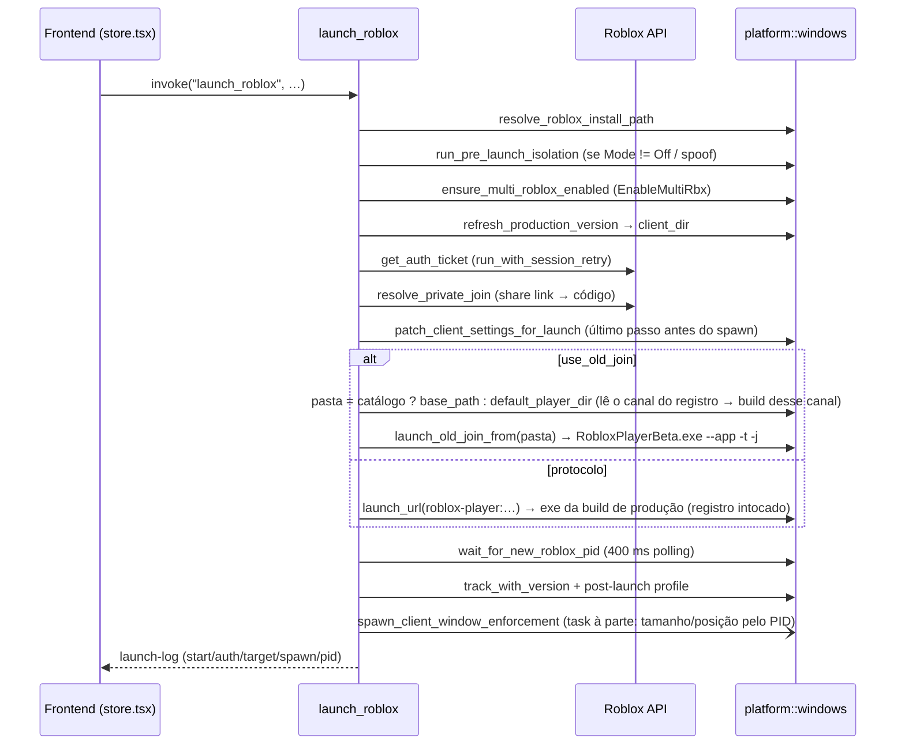

# Launch de conta única

## Objetivo

Abrir **um** cliente Roblox (`RobloxPlayerBeta.exe`) autenticado como uma conta específica, levando-o direto a um place/servidor (público, Job ID específico, VIP/privado ou "seguir usuário"), registrar o PID no tracker de processos e aplicar os pós-ajustes (posição de janela, minimizar, políticas de processo).

## Onde fica o código

| Arquivo | Papel |
|---|---|
| [launch.rs](../../src-tauri/src/commands/launch.rs) | Comando Tauri `launch_roblox` (Windows e macOS), `cancel_launch`, `cmd_kill_roblox`, `cmd_kill_all_roblox`, `cmd_enable_multi_roblox`, etc. |
| [launch_shared.rs](../../src-tauri/src/commands/launch_shared.rs) | Helpers compartilhados: `emit_launch_log`, detecção de conta moderada, `patch_client_settings_for_launch`, `get_or_create_browser_tracker_id`, `wait_for_new_roblox_pid`, `ensure_multi_roblox_enabled`, `resolve_launch_job`, `resolve_private_join`, `pick_shuffled_public_job` |
| [platform_info.rs](../../src-tauri/src/commands/platform_info.rs) | `get_platform_capabilities`: o que este SO suporta (o frontend usa para bloquear multi launch/botting fora do Windows) |
| [platform/windows/launch.rs](../../src-tauri/src/platform/windows/launch.rs) | `build_launch_url` (sempre com `channel:` vazio = produção), `launch_url` (protocolo → build de produção; não lê nem escreve o registro), `default_player_dir` (old join → build do canal **lido** do registro), `current_player_channel` (só leitura), `set_player_channel` (a única escrita: reparo de canal morto), `ensure_player_exe_for_channel` / `build_version_for_channel`, `refresh_production_version`, `cached_production_player_dir`, `client_source` / `client_dir` (a pasta de onde o cliente abre: patch e old join usam a mesma), `launch_old_join_from` |
| [platform/windows/core.rs](../../src-tauri/src/platform/windows/core.rs) | Mutex `ROBLOX_singletonMutex` (Multi Roblox, thread dedicada `multi-roblox-mutex`), lock do `RobloxCookies.dat` (fix 773), `generate_browser_tracker_id`, `get_roblox_path` (prefere a pasta da **última build de produção resolvida**, `cached_production_player_dir`) |
| [platform/windows/tracker.rs](../../src-tauri/src/platform/windows/tracker.rs) | `ProcessTracker`: PID por conta, launches pendentes, flag de cancelamento, `kill_for_user` / `kill_for_user_graceful` (só matam se o PID ainda for Roblox). Clientes abertos pelo site entram aqui por `track_adopted` — ver [external-clients.md](external-clients.md) |
| [platform/windows/versions.rs](../../src-tauri/src/platform/windows/versions.rs) | `resolve_roblox_install_path` (qual pasta de versão usar) |
| [account_api.rs](../../src-tauri/src/commands/account_api.rs) | `run_with_session_retry` (renova cookie e repete a chamada em erro de sessão) |
| [store.tsx](../../src/store.tsx) | `joinServer` → `invoke("launch_roblox")`; listener do evento `launch-log` |
| [launch_presets.rs](../../src-tauri/src/commands/launch_presets.rs) | Presets de launch: abrem pela fila (`launch_multiple`, sem mudar nada nela), anotam quais PIDs abriram e fecham só esses — ver [presets.md](presets.md) |

## Fluxo

1. Frontend chama `launch_roblox(userId, placeId, jobId, launchData, followUser, joinVip, linkCode, shuffleJob)`. `shuffleJob` é opcional no backend (`Option<bool>`, ausente = `false`).
1.1. Reserva a sequência de launch (`launch_queue_start`): com outro launch em andamento — inclusive uma fila de várias contas — o comando devolve `launch-already-active` e nada é lançado (ver [multi-launch.md](multi-launch.md#uma-sequência-de-launch-por-vez)).
2. Emite `launch-log` `start` ("Iniciando launch — place …").
3. Lê settings (`IsTeleport`, `UseOldJoin`, `AutoCloseLastProcess`, `AutoCloseRobloxForMultiRbx`, `StartRobloxMinimized`).
4. Resolve a instalação: `resolve_roblox_install_path(account.fields["RobloxVersion"], …)` → `(base_path, version_id)` (ver [roblox-versions.md](roblox-versions.md)).
5. Decide `use_old_join` (ver regras abaixo).
6. Roda o isolamento pré-launch (`run_pre_launch_isolation`, ver [isolation.md](isolation.md)); se aplicou, emite `isolation-report` e, se ficaram fast flags pendentes, agenda `apply_pending_fast_flags_when_ready` (240 s).
7. Guarda de versão: `tracker.cleanup_dead_processes()`; se algum cliente rodando (ou launch pendente) tem `version_id` diferente → erro de `version_conflict_message`, que diz em que versão a conta abre e **lista só as versões que impedem** — as diferentes do alvo (`None` aparece como `system install`) —, avisando que os clientes já na versão certa podem ficar. A lista não é enfeite: a guarda compara com uma versão alvo, então com duas chaves distintas no tracker — o Auto Rejoin não checa conflito, por desenho ([botting.md](botting.md)) — nenhum alvo a satisfaz, e sem a lista o usuário não tem como saber o que fechar. Listar **todas** as abertas (como era) mandava fechar também os clientes da versão certa, de outras contas. **Toggle** `Versions.AllowLaunchOnOpenVersion` (Settings > Versions, desligado por padrão): ligado, abrir numa versão que **já tem cliente aberto** passa, mesmo com outras versões abertas ao lado (`version_guard_blocks`) — é a saída quando o Auto Rejoin deixou duas versões abertas. Versão que não está aberta continua recusada. Desligado, a frase da recusa aponta o toggle quando ele resolveria (o alvo já está aberto).
8. Multi Roblox: se `EnableMultiRbx`, `ensure_multi_roblox_enabled`; senão `disable_multi_roblox`.
9. `refresh_production_version().await` (resolve a build de produção e a guarda como "última build resolvida") e em seguida `patch_client_settings_for_launch(Normal, …, Some(&resolved_base_path))` (FPS, volume, gráficos, tamanho de janela, fast flags da allowlist ou arquivo custom). A pasta do patch vai **explícita** no parâmetro — é a da versão resolvida no passo 4 (sem versão do catálogo, o que `get_roblox_path()` devolveu **naquele** momento, antes do refresh), não a que `get_roblox_path()` escolheria agora. Sem versão do catálogo isso nem sempre é a pasta que abre — ver [Onde o `ClientAppSettings.json` é gravado](#onde-o-clientappsettingsjson-é-gravado).
10. Se `AutoCloseLastProcess` e a conta já tem PID → fecha (timeout 4500 ms); se não fechar, aborta.
11. `resolve_launch_job` (prefixo `vip:`, link de share, `linkCode`); com `followUser` o VIP é descartado.
12. `shuffleJob` (sem job e sem follow, ver `should_shuffle_server`): `pick_shuffled_public_job` busca servidores públicos e escolhe um índice baseado no relógio (`shuffle_server_index`, nanos % n). Falha ou lista vazia → segue com o Job ID vazio.
13. `browserTrackerId`: reutiliza o da conta ou gera e persiste um novo.
14. Auth ticket via `run_with_session_retry` (`launch-log` `auth`). Erro com "moderated"/"is banned"/"account has been" → conta movida para o grupo `moderadas` + evento `account-moderated`.
15. `resolve_private_join` → `place_id` final, `access_code` ou `link_code`, `use_private_join`.
16. Snapshot de PIDs (`get_roblox_pids`), registra launch pendente (`add_pending_launch`, timeout = espera + 30 s).
17. Spawn: `launch_old_join_from(pasta, …)` **ou** `build_launch_url(…)` + `launch_url(url).await`. No old join, `pasta` = `base_path` se a versão é do catálogo (`version_id = Some`); sem versão do catálogo (`version_id = None`) usa `default_player_dir(base_path).await`, que **lê** o canal do registro (a única escrita possível é o reparo de canal morto — ver o fix, item 2) e devolve a pasta da build **daquele canal**, instalando-a se faltar (`base_path` só se nem isso der). Pelo protocolo, `launch_url` abre a build de **produção** — o `channel:` vazio da URL vence o registro —, sem ler nem escrever o registro.
18. `wait_for_new_roblox_pid` (polling a cada 400 ms; 12 s, ou 180 s se o isolamento Full vai forçar reinstalação).
19. PID encontrado → `track_with_version`, `versions.touch_launched`, `apply_windows_post_launch_profile`, restaura posição/tamanho de janela salva (até 45 tentativas de 1 s) e, se `StartRobloxMinimized`, minimiza janelas novas por 14 s.



### Os dois modos de spawn

**Protocolo (`build_launch_url` + `launch_url`)** — monta
`roblox-player:1+launchmode:play+gameinfo:<ticket>+launchtime:<ms>+placelauncherurl:<url-encoded>+browsertrackerid:<id>+robloxLocale:en_us+gameLocale:en_us+channel:+LaunchExp:InApp`.
O `placelauncherurl` aponta para `https://assetgame.roblox.com/game/PlaceLauncher.ashx` com:
- `request=RequestPrivateGame&placeId=…&accessCode=…&linkCode=…` (VIP);
- `request=RequestFollowUser&userId=<placeId recebido>` (follow — o "place_id" carrega o userId alvo);
- `request=RequestGame` ou `RequestGameJob&gameId=<job>` + `browserTrackerId`, `isPlayTogetherGame=false`, `isTeleport=true` opcional;
- `launchData` é anexado url-encoded quando não vazio.

**Old join (`launch_old_join_from`)** — executa diretamente `<pasta>\RobloxPlayerBeta.exe --app -t <ticket> -j <PlaceLauncher URL>` (mesma URL acima, sem `browserTrackerId` no modo público). Falha se o exe não existir na pasta. A pasta é a da versão do catálogo ou, sem catálogo, `default_player_dir` (a build do canal que está no registro — sem URL, é esse o canal que o cliente consulta). Todos os caminhos (launch de uma conta, fila, Auto Rejoin, web server) recebem essa pasta de `client_dir` — a mesma em que o patch de client settings foi gravado.

## Canal do Roblox e a tela de atualização (causa raiz e fix)

### Sintoma

Ao abrir uma segunda conta, aparecia a tela azul com o logo do Roblox e o botão "Cancelar" (instalador em primeiro plano) e **todas as outras contas abertas eram fechadas**.

### Causa raiz

1. O Roblox inscreve cada **conta** num canal de deploy. Observado: `ztestlinkerset` → build `version-68d22e1888b04c2f`; `zswocc-500-c`/production → `version-4310300497aa4917`.
2. Depois que uma conta entra num jogo, o cliente dela dispara em segundo plano um `RobloxPlayerInstaller -channel <canal da conta>`, que instala essa build e **reescreve** o handler do protocolo `roblox-player:` e o valor de registro `HKCU\Software\ROBLOX Corporation\Environments\RobloxPlayer\Channel` (`www.roblox.com`).
3. O próximo launch via `roblox-player:` iniciava um cliente cuja build não batia com o canal que ele lia → `updateRequired TRUE` → instalador em primeiro plano (a tela azul com "Cancelar").
4. Esse instalador procura e fecha **todo** `RobloxPlayerBeta.exe` em execução, matando as outras contas.

### Fix (em `launch_url` e `default_player_dir`, ambos `async`) — [platform/windows/launch.rs](../../src-tauri/src/platform/windows/launch.rs)

1. **A build tem que casar com o canal que o cliente vai consultar** — e quem decide isso é o campo `channel:` de dentro da URL de launch, **não** o registro. Provado nos logs (24/09/2026): registro em `ztestlinkerset` + URL com `channel:` vazio → o cliente consultou o endpoint de produção (`channel: ""`) e deu `updateRequired TRUE`; a mesma URL com a build de produção deu `FALSE`.
   - **Protocolo** (`launch_url`, caminho normal): `build_launch_url` sempre emite `channel:` vazio (= produção, igual ao site) → abre a build de **produção**. O registro não é lido nem escrito aqui.
   - **Old join** (`default_player_dir`, sem URL): o cliente cai no canal do **registro** → build daquele canal. A única escrita no registro é o reparo (`set_player_channel`) quando o endpoint do canal não responde mais.
2. `build_version_for_channel(canal)`: consulta o endpoint do canal — `.../v2/client-version/WindowsPlayer` para production, `.../WindowsPlayer/channel/<canal>` para os demais (o literal `production` responde 401 no formato `/channel/`, por isso a separação). Lê `clientVersionUpload` (precisa começar com `version-`). Cache em memória por canal, **60 s** (`PRODUCTION_VERSION_CACHE_TTL`); se a rede falhar, usa o cache vencido (stale). O protocolo pergunta sempre por `production`; o old join pergunta pelo canal que `current_player_channel` **lê** do registro (vazio ou ausente = `production`). Se o endpoint desse canal responder **401/404** (canal aposentado pelo Roblox) e o de produção responder, usa a build de produção **e** grava `production` no registro com `set_player_channel`, para o cliente não ler um canal morto e divergir da build aberta (`fetch_channel_build`). Qualquer outra falha — timeout, 429, 5xx, resposta ilegível — não diz nada sobre o canal: não consulta a produção, não grava nada e cai no cache vencido (`channel_repair_tests`). **Essa é a única escrita do canal feita pelo app** (o isolamento Medium/Full apaga a chave inteira do Roblox, canal junto — ver [isolation.md](isolation.md)); o protocolo nunca chega a ela, porque só consulta `production`.
3. `player_exe_for_channel(canal)` / `installed_player_exe(build)`: acham `%LOCALAPPDATA%/Roblox/Versions/<build>/RobloxPlayerBeta.exe` da build daquele canal. Pelo protocolo, `launch_url` executa esse `RobloxPlayerBeta.exe <url roblox-player:…>` diretamente (`CREATE_NO_WINDOW`) — o mesmo que o instalador oficial faz.
4. `ensure_player_exe_for_channel(canal)`: se a build do canal **não** estiver instalada (o Roblox publicou uma versão nova ou — no old join — o canal do registro mudou), o app **baixa e instala essa build ele mesmo** em `%LOCALAPPDATA%\Roblox\Versions\<build>`, reusando `install_build_to_dir` — o mesmo motor da tela de Versões ([platform/windows/versions.rs](../../src-tauri/src/platform/windows/versions.rs)). Isso evita acionar o instalador do Roblox, que roda em primeiro plano e fecha todos os clientes abertos. Um `tokio::sync::Mutex` serializa o download (um launch múltiplo baixa uma vez só) e o progresso vai para a UI pelo evento `roblox-build-install` (barra de status: "Baixando a nova versão do Roblox..."). Builds de canais de teste vêm de `/channel/common/` no CDN (fallback que `install_build_to_dir` já tinha). Cada build é baixada **uma vez** e fica em disco; jogar pelo site depois não força download nenhum, porque app e site passam a concordar sobre qual build usar.
5. Só se esse download falhar, `launch_url` cai no último recurso `cmd /C start "" <url>` (handler do protocolo) — aí sim a tela do instalador do Roblox pode aparecer. No old join a falha devolve a pasta recebida como `fallback`.
6. **Old join sem versão do catálogo** também é coberto: `default_player_dir(fallback)` lê o canal do registro, garante a build **daquele canal** (itens 2–4) e devolve a pasta dela — ou `fallback` (a pasta resolvida por `get_roblox_path`) se não conseguir nem achar nem instalar. Fora o reparo do item 2 (que só este caminho alcança), **não escreve nada no registro**. Usado via `client_dir` (`RegistryChannel`) em `launch_roblox`/`launch_multiple`/Auto Rejoin quando `version_id = None` e no web server com `UseOldJoin`.
7. **ClientSettings:** em `launch_roblox`, `launch_multiple`, no Auto Rejoin e no web server a pasta do patch é a pasta de onde o cliente vai abrir, resolvida uma vez por `client_dir` e usada também pelo spawn do old join — ver [Onde o `ClientAppSettings.json` é gravado](#onde-o-clientappsettingsjson-é-gravado). `get_roblox_path()` prefere `cached_production_player_dir()` — a última build **de produção** resolvida, se tiver `RobloxPlayerBeta.exe` — antes de `HKCR/roblox/DefaultIcon`.

> **Regras (críticas — ver `CLAUDE.md`). O que NÃO fazer:**
> - **Não escrever o canal do Roblox no registro** — nem `production`, nem outro valor, nem para "consertar" divergência. O usuário também joga pelo site: com o registro forçado, o launch pelo site diverge, o instalador do Roblox roda e **fecha todos os clientes abertos**. Era exatamente o que o app fazia até 22/09/2026, quando `0e8190c` desfez: fixar `production` consertava o launch pelo app e quebrava o launch pelo site. A única escrita que existe é o reparo automático do item 2 — não crie outra.
> - **Não tratar canal ≠ `production` no registro como defeito.** Quem grava o canal é o Roblox, ao inscrever a conta num canal de teste. O protocolo abre a build de produção seja qual for o registro (o `channel:` vazio da URL vence); o old join sem catálogo **segue** o registro. Build de produção aberta pelo protocolo com o registro em `ztestlinkerset` é o comportamento certo.
> - **Não chamar o handler `roblox-player:` por conta própria.** Launch por URL passa por `windows::launch_url` (que só cai no handler se o download da build falhar — item 5); old join sem versão do catálogo pega a pasta por `windows::default_player_dir`, nunca direto de `get_roblox_path` nem da chave `HKCR/roblox`.

Evidências ficavam em `%LOCALAPPDATA%\Roblox\logs`: `RobloxPlayerInstaller_*.log` com "Found N processes matching RobloxPlayerBeta.exe" e logs do cliente com "RobloxChannel has been set to …" seguidos de "updateRequired TRUE".

### Como diagnosticar se voltar a acontecer

```powershell
$logs = "$env:LOCALAPPDATA\Roblox\logs"

# 1. O instalador fechou clientes?
Select-String -Path "$logs\RobloxPlayerInstaller_*.log" -Pattern "Found \d+ processes matching RobloxPlayerBeta.exe" |
  Select-Object -Last 10

# 2. Qual canal cada cliente leu?
Select-String -Path "$logs\*.log" -Pattern "RobloxChannel has been set to" | Select-Object -Last 20

# 3. Algum cliente pediu atualização?
Select-String -Path "$logs\*.log" -Pattern "updateRequired TRUE" | Select-Object -Last 20

# 4. Instalador disparado com canal de conta (-channel)?
Select-String -Path "$logs\RobloxPlayerInstaller_*.log" -Pattern "-channel" | Select-Object -Last 10

# 5. Canal atual no registro — SÓ LEITURA. Qualquer valor é normal: quem grava é o Roblox.
#    NÃO altere: forçar 'production' aqui faz o launch pelo site chamar o instalador do
#    Roblox, que fecha todos os clientes. O valor só decide a build do old join sem
#    catálogo; o protocolo abre a build de produção seja qual for o registro.
Get-ItemProperty "HKCU:\Software\ROBLOX Corporation\Environments\RobloxPlayer\Channel" -Name "www.roblox.com"

# 6. Build production atual x builds instaladas
(Invoke-RestMethod https://clientsettingscdn.roblox.com/v2/client-version/WindowsPlayer).clientVersionUpload
Get-ChildItem "$env:LOCALAPPDATA\Roblox\Versions" -Directory | Select-Object Name, LastWriteTime
```

Checklist:
- [ ] O launch passou por `windows::launch_url` (protocolo) ou por `default_player_dir` (old join sem catálogo), e não por `cmd start`/pasta do registro direto em outro lugar?
- [ ] A build aberta casa com o canal que **o cliente** vai consultar? Pelo protocolo é produção, seja qual for o registro (o `channel:` vazio da URL vence): build de produção com o registro num canal de teste é o comportamento **certo**. Só no old join sem catálogo o canal é o do registro (`current_player_channel` × endpoint daquele canal). Se divergirem, o cliente pede update. Em nenhum dos casos o conserto é escrever no registro.
- [ ] A build que o `clientsettingscdn` devolve para esse canal existe em `%LOCALAPPDATA%/Roblox/Versions`? Se não, o app deveria ter baixado ela (evento `roblox-build-install`); se apareceu a tela do instalador do Roblox, esse download falhou — procure `Could not install Roblox build` no stderr do app (a linha traz a build e o canal: `Could not install Roblox build <build> (channel <canal>): <erro>`).
- [ ] O isolamento está em Medium/Full? Eles apagam `HKCU\Software\ROBLOX Corporation` (e Full apaga `Versions`), o que força reinstalação.
- [ ] A conta usa `RobloxVersion`/`DefaultVersion` do catálogo? Então é old join com o exe da pasta RAM, como está: o app não consulta canal nenhum para essa build (se estiver velha, o próprio cliente pode pedir update).
- [ ] O `ClientAppSettings.json` com os flags está na pasta **da versão que esta conta vai abrir**? Com versão do catálogo é a pasta dessa versão; achar o arquivo na de produção nesse caso é o defeito, não a prova. Sem versão do catálogo, a pasta do patch é a que `get_roblox_path()` (`cmd_get_roblox_path`) devolveu **antes** do launch — e há três casos conhecidos em que ela não é a que abriu (primeiro launch da sessão, primeiro launch depois de build nova, old join com o registro num canal de teste): é limitação do código, descrita em [Onde o `ClientAppSettings.json` é gravado](#onde-o-clientappsettingsjson-é-gravado), não defeito novo.

## Teto de tempo das chamadas HTTP do launch

Toda chamada HTTP do launch tem teto. Antes não tinha nenhum: `reqwest::Client::new()` espera indefinidamente, então o pior caso da espera do launch era o da pilha de rede, não do app. Isso importa por causa da **reserva de sequência** (um launch por vez, ver [multi-launch.md](multi-launch.md#uma-sequência-de-launch-por-vez)): uma conta em voo presa num endpoint mudo segura a fila e faz o app recusar todo launch novo por tempo indeterminado.

Os valores ficam em [api/http_client.rs](../../src-tauri/src/api/http_client.rs):

| Teto | Valor | Onde vale | Por quê |
|---|---|---|---|
| `CONNECT_TIMEOUT` | 10 s | todos os clientes | Fecha a **conexão pendurada** (handshake que nunca completa) com bound próprio. `timeout` sozinho também cobriria o handshake, mas só no fim do teto total — no cliente de download isso seria 3 minutos parado num socket que nunca falou TLS. Handshake frio fecha em bem menos de 1 s; 10 s é ~20x isso. |
| `REQUEST_TIMEOUT` | 30 s | chamadas de API (auth ticket, private join/VIP, listagem de servidores, e o resto de `api/`) | Requisição inteira: conexão + resposta + corpo. As chamadas do launch são JSON pequeno que responde em centenas de ms; 30 s é ~30x isso, com folga para endpoint degradado que ainda responde. Curto demais transformaria launch que funcionava em launch que falha. |
| `DOWNLOAD_REQUEST_TIMEOUT` | 180 s | download silencioso de build ([versions.rs](../../src-tauri/src/platform/windows/versions.rs)) | Teto **próprio e maior**: um zip de build passa de 100 MB e o teto de uma chamada de API cortaria um download que ia bem. É o valor que esse ponto já praticava; o que ele ganhou foi o `CONNECT_TIMEOUT`. |
| `CHANNEL_LOOKUP_TIMEOUT` | 6 s | consulta "qual build este canal exige" ([launch.rs](../../src-tauri/src/platform/windows/launch.rs)) | **Abaixo** do teto de API de propósito: essa consulta tem fallback (cache vencido, ou o canal de produção), então esperar mais só atrasaria o launch sem mudar o resultado. Valor que o ponto já praticava. |

Mensagem de erro: `http_client::describe_error` transforma timeout em frase ("Roblox took too long to answer…" / "Could not reach Roblox: the connection timed out…"). Sem isso o usuário lia o `Display` cru do `reqwest` — `error sending request for url (…)` —, que não diz o que aconteceu, porque o "operation timed out" fica escondido na cadeia de `source`. Os outros erros de transporte continuam com o `Request failed: …` de antes.

**Pior caso da espera do launch** (todas as chamadas estourando o teto, VIP + shuffle ligados): consulta de canal 2 × 6 s, auth ticket com refresh de sessão 5 × 30 s, resolução de private join até 4 × 30 s, shuffle 1 × 30 s ≈ **5 min**, mais o download de build quando a build de produção falta (180 s por zip, em paralelo). Continua muito, mas é **finito** — antes era indeterminado. O multiplicador é o número de requisições em série (e os 3 attempts de `send_with_retry`), não o valor do teto; encurtar o teto não resolveria isso sozinho.

## Regras de negócio

- **Escolha de `use_old_join`:** `false` se `Isolation.Mode = Full` **e** a versão resolvida não é do catálogo (o Full vai apagar a instalação do sistema); caso contrário `Developer.UseOldJoin || version_id.is_some()`. Ou seja: qualquer versão gerenciada pelo catálogo (override da conta, `DefaultVersion` ou a mais recente do catálogo) sempre usa old join.
- **Um launch por vez:** o launch de uma conta e a fila de várias contas compartilham a mesma reserva; disparar o segundo enquanto o primeiro anda é recusado com `launch-already-active` ("Já existe um launch em andamento"), não enfileirado. A recusa chega à tela pelo resultado do `joinServer` do store (`LaunchAttempt`: `started` / `refused` / `failed`), para nada anunciar um launch que não começou. Detalhes e caminhos de liberação em [multi-launch.md](multi-launch.md#uma-sequência-de-launch-por-vez).
- **Clientes simultâneos devem estar na mesma versão:** se o tracker tiver qualquer processo/launch pendente com `version_id` diferente, o launch é recusado.
- **Multi Roblox (`EnableMultiRbx`) — são duas travas diferentes, e o app trata as duas** ([core.rs](../../src-tauri/src/platform/windows/core.rs), [singleton.rs](../../src-tauri/src/platform/windows/singleton.rs)):
  1. **`ROBLOX_singletonMutex` (preventivo).** O app cria (com `bInitialOwner = 0`) e adquire o mutex numa **thread dedicada de longa duração** (`multi-roblox-mutex`), que o segura até receber o sinal de liberação por um canal `mpsc` (`release_multi_roblox_mutex`, usado por `disable_multi_roblox` e `release_multi_roblox_handle`); só então faz `ReleaseMutex` + `CloseHandle` nessa mesma thread. Motivo: posse de mutex Win32 é por thread — `ReleaseMutex` só funciona na thread que adquiriu e, se ela terminar, o mutex fica abandonado e um cliente Roblox pode pegá-lo (voltando ao modo instância única); threads do tokio não garantem nenhuma das duas coisas. **Só resolve se o app pegar o mutex antes de qualquer cliente subir**: com um jogo já aberto (usuário entrou pelo site), o mutex é do cliente e não há como tomá-lo sem matar o processo.
  2. **`ROBLOX_singletonEvent` (o que o cliente moderno consulta).** Ao subir, o cliente checa esse nome; se existe, avisa a instância antiga e sai. `close_roblox_singleton_handles()` fecha esse handle **de fora**: enumera a tabela de handles do sistema (`NtQuerySystemInformation`), filtra só objetos do tipo Event **dos processos do Roblox**, casa o nome exato (`\...\ROBLOX_singletonEvent`, com fronteira de namespace) e fecha com `DuplicateHandle(DUPLICATE_CLOSE_SOURCE)`. O nome some, **o cliente aberto continua jogando** e o próximo sobe normal. Validado na máquina do usuário **sem elevação**.
  - **Ordem:** tenta o mutex → fecha os Events (inclusive quando o mutex foi obtido, para cobrir "app abriu primeiro, jogo pelo site depois") → segue o launch. Se nada disso resolver (quem segura o mutex não é Roblox, ex.: RAM legado) → erro específico, ou o último recurso antigo `AutoCloseRobloxForMultiRbx` matando clientes.
  - **Event que já não existe também libera** (`can_open_another_client`, [core.rs](../../src-tauri/src/platform/windows/core.rs)): com o mutex nas mãos de um cliente aberto, o launch segue se algum Event foi fechado agora **ou** se o nome `ROBLOX_singletonEvent` nem existe mais (`named_event_exists`) — ele foi fechado numa leva anterior e os clientes que o recriaram saíram. Antes só o "fechei algum" valia: com a principal aberta pelo site, uma leva de alts entrava (o app fechava o Event da principal) e, depois de fechar essas alts, todo launch dava "A Roblox client is already running" sem nada a destravar (relato do dono, 28/09/2026). Sem cliente Roblox aberto, nada muda: segue o caminho antigo.
  - Falha de API (anti-cheat bloqueando `OpenProcess`, por exemplo) devolve 0 e cai no caminho antigo, sem quebrar o launch.
  - **Experimental, desligado por padrão — reservar o nome (ideia 3, `General.ReserveSingletonEvent`, "Experimental: keep clients open across teleports" em Settings › General, só com Multi Roblox).** Problema: quando um cliente teleporta de place, ele refaz a checagem de instância única, recria o `ROBLOX_singletonEvent` e um dos clientes pode fechar. Com a opção ligada, logo depois de fechar os Events o `enable_multi_roblox` chama `apply_singleton_reservation`: se o nome está livre, o app cria um **Mutex** (sem dono) com o nome `ROBLOX_singletonEvent` e guarda o handle (`SINGLETON_RESERVATION`). Como o nome passa a ser de outro tipo de objeto, nenhum cliente consegue criar o Event (`CreateEventW` falha — provado em `a_reserved_name_cannot_be_created_as_an_event`, com nome de teste).
    - Decisão pura em `reservation_step(enabled, held, event_exists_now)`: ligada e livre → cria; ligada e um cliente ainda segura o Event (não deu para fechar) → espera, e o método atual segue valendo; desligada com reserva → solta; o resto não faz nada (`singleton_reservation_tests`).
    - `named_event_exists` responde "existe" também para a nossa reserva (o `OpenEventW` falha por tipo errado); por isso o `can_open_another_client` recebe `event_blocks_next_client(existe, reservado_por_nós)` — a nossa reserva não barra o próximo cliente.
    - **Nunca fecha cliente:** só cria ou fecha um handle **do app**. A reserva sai em `disable_multi_roblox` (Multi Roblox desligado e ao fechar o app) e quando a opção é desligada (`set_singleton_reservation_enabled(false)`, chamado no próximo launch). A parte do projeto de onde a ideia veio que **mata os clientes antes** não foi trazida.
    - A opção chega ao backend por `ensure_multi_roblox_enabled(auto_close, reserve)` (launch único, fila e Auto Rejoin) e pelas rotas de launch do servidor HTTP.
    - **Falta o teste do dono:** 2+ contas abertas pelo app, teleportando entre places, com a opção ligada; e conferir que um cliente novo ainda abre com o nome reservado. Se um cliente parar de abrir, a descrição manda desligar. A checagem do launch ([support.md](support.md)) mostra se a reserva está ativa.
- **Fix 773:** ao habilitar/desabilitar Multi Roblox, o app abre `%LOCALAPPDATA%\Roblox\LocalStorage\RobloxCookies.dat` com compartilhamento 0 (lock exclusivo) e mantém o handle. Desativável criando `no773fix.txt` ao lado do executável.
- **Browser tracker id:** um por conta, persistido em `account.browser_tracker_id`; gerado a partir do relógio (`generate_browser_tracker_id`).
- **Sessão expirada:** `run_with_session_retry` tenta `log_out_other_sessions` para obter novo cookie, persiste e repete a operação uma vez. **Exceção:** o relaunch da [reconexão automática](watcher.md#reconexão-automática) chama `launch_roblox_windows` com `allow_session_refresh = false` (ticket e private join sem refresh): ninguém está olhando, e o refresh desloga a conta de todo lugar. Sessão expirada vira erro e a reconexão para.
- **Destino guardado para a reconexão:** quando o cliente sobe (`Done`), o launch único e a fila gravam em memória o que foi pedido (`remember_launch_target`: place, Job ID cru, launch data, VIP/link, se foi servidor privado). A reconexão de servidor privado usa exatamente isso.
- **Conta banida/encerrada é pulada antes de tudo** (`moderation_launch_block`, logo depois do log de início da conta, antes do isolamento e do auth ticket): consulta `usermoderation/v1/not-approved` sem refresh (cache de 10 min, teto de 8 s), e conta com ban valendo ou encerrada sai como `Failed` com "Skipped: this account is banned until …" — no lote, a fila segue. Falha da consulta não bloqueia. Desligável em `General.CheckModerationBeforeLaunch`. Ver [accounts.md](accounts.md) (Moderação).
- **Roblox pedindo verificação** (403 com `rblx-challenge-*` no auth ticket) vira frase que manda concluir a verificação no navegador da conta — ver [authentication.md](authentication.md).
- **Conta moderada:** erro de auth ticket contendo `moderated` / `is banned` / `account has been` move a conta para o grupo `moderadas` (não duplica se já estiver).
- **VIP/privado:** `vip:<código>` no Job ID força VIP; links com `privateServerLinkCode`, `linkCode` ou `code` (share links) são extraídos; códigos de share (32 hex) são resolvidos via API; código no formato de 5 partes separadas por `-` é tratado como `accessCode`, o resto como `linkCode`. Se o link tiver `/games/<id>`, o place do link prevalece.
- **Follow user:** desliga VIP e link code; o parâmetro `placeId` é usado como `userId` no `RequestFollowUser`. Follow e shuffle nunca coexistem (`should_shuffle_server` devolve `false` com `followUser`).
- **PID:** detectado como "primeiro `RobloxPlayerBeta.exe` que não estava no snapshot anterior". Se não aparecer no tempo, emite `warn` `pid` e a conta não é rastreada (sem posição de janela, sem minimizar).
- **Posição de janela:** só restaurada se a conta tiver os 4 campos `Window_Position_X/Y`, `Window_Width`, `Window_Height` (gravados pelo Watcher com `SaveWindowPositions`), pela mesma task que confere o tamanho — ver [Tamanho da janela conferido pelo PID](#tamanho-da-janela-conferido-pelo-pid).
- **Eventos `launch-log`:** payload `{userId, level: info|success|warn|error, step, message}`; steps usados: `start`, `isolation`, `auth`, `moderated`, `target`, `spawn`, `pid`, `wait`. O frontend guarda no máximo 500 entradas.
- **Close All Roblox** (`cmd_kill_all_roblox`) mata todos os `RobloxPlayerBeta.exe`, chama `cancel_launch()` e remove tudo do tracker.
- **Fechar o cliente de uma conta** (`kill_for_user` / `kill_for_user_graceful`, usados por `AutoCloseLastProcess`, `cmd_kill_roblox` e botting): só mata se o PID rastreado ainda for um processo Roblox (`is_roblox_pid_alive`); caso contrário apenas remove do tracker e retorna sucesso (proteção contra reuso de PID pelo Windows).
- **Preset com horário de fechar** ([presets.md](presets.md)) fecha só os clientes que **aquela** execução abriu: confere conta + PID no tracker e pula cliente adotado do site. Não existe outro caminho de fechamento em lote além do "Close All Roblox" explícito.
- **Ao sair do app** o app **não fecha** cliente nenhum: só solta o mutex do Multi Roblox (e a reserva experimental do nome, se houver) e limpa o rastreamento (`exit_cleanup_tests`, ver CLAUDE.md).

## Configurações relacionadas

Arquivo `RAMSettings.ini`.

| Seção | Chave | Default | Efeito |
|---|---|---|---|
| General | `EnableMultiRbx` | — | Segura `ROBLOX_singletonMutex` para permitir vários clientes |
| General | `AutoCloseRobloxForMultiRbx` | `false` | Mata clientes abertos se o mutex não puder ser adquirido |
| General | `AutoCloseLastProcess` | `false` | Fecha o cliente anterior da mesma conta antes de relançar |
| General | `StartRobloxMinimized` | `false` | Minimiza janelas novas por até 14 s após o launch |
| General | `AutoArrangeGrid` | `true` | Põe a janela nova na primeira célula livre da grade ([ui-layout.md](ui-layout.md#grade-de-janelas)) |
| General | `UnlockFPS`/`MaxFPSValue`, `OverrideClientVolume`/`ClientVolume`, `OverrideClientGraphics`/`ClientGraphicsLevel`, `OverrideClientWindowSize`/`ClientWindowWidth`/`ClientWindowHeight`, `CustomClientSettings` | ver store | Aplicados em `ClientAppSettings.json` antes do launch (arquivo custom tem precedência e desativa o FPS/fast flags) |
| Developer | `UseOldJoin` | `false` | Força `RobloxPlayerBeta.exe --app -t -j` |
| Developer | `IsTeleport` | `false` | Adiciona `isTeleport=true` na URL do PlaceLauncher |
| Isolation | `Mode` | `Off` | Ver [isolation.md](isolation.md); `Full` altera a escolha de old join e a espera do PID |
| Versions | `DefaultVersion` | vazio | Ver [roblox-versions.md](roblox-versions.md) |

Campos por conta (`account.fields`): `RobloxVersion`, `Window_Position_X`, `Window_Position_Y`, `Window_Width`, `Window_Height`, e as exceções de launch abaixo.

## Exceções de launch por conta

Uma conta pode abrir com FPS, volume, qualidade, modo de tela e "minimizar ao abrir" próprios, por cima do perfil global. Serve para o caso "a conta principal abre em tela cheia a 240 fps e as outras abrem no jeito limitado".

Onde fica: `Account.fields` (`AccountData.json`), lido por `account_client_overrides` em [launch_shared.rs](../../src-tauri/src/commands/launch_shared.rs). Tela: seção **Launch Exceptions** na sidebar da conta ([AccountLaunchOverrides.tsx](../../src/components/accounts/AccountLaunchOverrides.tsx)).

| Campo | Valores | Efeito |
|---|---|---|
| `ClientOverridesEnabled` | `true` | Interruptor. Sem ele em `true`, os outros campos são ignorados (dá para guardar uma configuração desligada). |
| `ClientOverrideMaxFPS` | inteiro > 0 | `FramerateCap` + `DFIntTaskSchedulerTargetFps`. Ignorado quando há `CustomClientSettings` válido, igual ao global. |
| `ClientOverrideVolume` | fração `0.0`–`1.0` | `MasterVolume`. A tela mostra a escala de 0 a 10 do jogo e grava a fração. |
| `ClientOverrideGraphics` | `auto` ou `1`–`10` | `auto` grava `SavedQualityLevel=0` (qualidade automática) e **não** mexe no `GraphicsQualityLevel`; um número grava o nível fixo. |
| `ClientOverrideFullscreen` | `true` / `false` | `Fullscreen`. `true` também descarta o tamanho de janela global (senão o XML gravaria `Fullscreen=false` ao lado). |
| `ClientOverrideStartMinimized` | `true` / `false` | Substitui `StartRobloxMinimized` para esta conta (vale no launch e no Auto Rejoin). |
| `ClientOverrideWindowWidth` / `ClientOverrideWindowHeight` | inteiros > 0 | `StartScreenSize`. Só valem **em par** — largura sem altura é ignorada. |

Campo vazio quer dizer "herda o global", não "zero": um FPS apagado não é FPS 0.

Aplicado em: launch de uma conta, fila de várias contas (dentro do laço, por conta) e Auto Rejoin. O servidor HTTP local não tem contexto de conta nesse ponto e usa só o perfil global.

**Ressalva importante.** `ClientAppSettings.json` é por pasta de versão do Roblox e `GlobalBasicSettings_13.xml` é por usuário do Windows — os dois são **globais**. "Por conta" funciona porque a fila é sequencial e o patch roda imediatamente antes de cada spawn; não é isolamento de verdade.

**A exceção não vaza para a próxima conta** (`OverrideLedger`, [client_settings.rs](../../src-tauri/src/platform/windows/client_settings.rs)). Até 30/09/2026 vazava: a conta principal gravava a qualidade dela no XML, e a conta seguinte, sem exceção e sem qualidade no perfil global, não reescrevia nada — abria com a qualidade da principal (relatado pelo dono). Agora cada propriedade que uma exceção escreve (qualidade, volume, FPS no XML e no `ClientAppSettings.json`, tela cheia/janela) fica registrada com o valor que estava lá **antes** e o que a exceção escreveu, em `ClientOverrideLedger.json` na pasta de dados (sobrevive a fechar o app). Na próxima abertura sem exceção para aquela propriedade:
- o perfil global define o valor → vale o global, e o registro é descartado;
- o arquivo ainda tem o valor da exceção → volta o valor de antes (ou a propriedade some, se a exceção a criou);
- o arquivo tem outro valor → foi o jogador que mudou dentro do jogo, e o valor dele fica.

**Com cliente do Roblox aberto, o registro do XML não é consumido** (03/10/2026). O cliente da exceção, aberto, **regrava** o XML com o valor dela — a conta principal com "Tela: cheia" grava `Fullscreen=true` de novo depois que a primeira alt pôs o valor do jogador de volta, e a segunda alt, sem registro, abria em tela cheia. Agora, enquanto houver qualquer cliente aberto, desfazer não apaga o registro: cada conta sem exceção desfaz de novo. Ele só sai quando o arquivo tem um valor que não é nem o da exceção nem o de antes (foi o jogador), quando o perfil global escreve a propriedade, ou na primeira abertura sem nenhum cliente aberto (o cliente da exceção já fechou). Vale para todas as propriedades do XML; o `ClientAppSettings.json` não é regravado por cliente aberto e segue como antes. Além disso, quando uma exceção de outra conta mexeu no `Fullscreen` e esta conta não decidiu nada sobre a janela, o patch devolve o valor que ficou no arquivo (o do jogador) como a tela cheia resolvida desta conta (`GuardedRewrite::fullscreen_from_ledger`): `false` vira "em janela" na conferência pelo PID abaixo, `true` (o jogador já jogava em tela cheia) é respeitado. Sem exceção nenhuma no caminho, o app não diz nada sobre a tela cheia — é preferência do jogador no Roblox. Testes: `a_fullscreen_exception_does_not_leak_into_the_next_account`, `while_the_fullscreen_account_is_open_every_alt_gets_the_windowed_value_back` e vizinhos.

Quem diz o que veio da conta é o `from_account` (`AccountSourced`) que o `windows_client_overrides` monta. Testes: `win_client_settings_tests` (`an_account_exception_does_not_leak_into_the_next_account` e vizinhos; o grupo da janela em `the_global_window_size_replaces_the_main_accounts_exception` e vizinhos).

### Tamanho da janela conferido pelo PID

O registro não resolve tudo: um cliente aberto reescreve o XML por conta própria (o Roblox grava o `StartScreenSize` dele), e se isso acontece entre o patch e o instante em que o cliente novo lê o arquivo, a conta nova abre com o tamanho da outra. Foi o bug de 03/10/2026: perfil global 520x420, exceção da conta principal 1000x1000 — as alts abriam em 1000x1000. Duas camadas, no launch de uma conta, na fila e no Auto Rejoin:

1. **O patch é o último passo antes do spawn** — depois do fechamento gracioso (`AutoCloseLastProcess`), do auth ticket e do `resolve_private_join`, que eram o intervalo em que um cliente aberto reescrevia o XML. `patch_client_settings_for_launch` devolve o que resolveu para a janela (`ResolvedClientWindow`). Teste: `client_window_order_tests`, que lê o código dos três caminhos.
2. **Conferência pelo PID** (`spawn_client_window_enforcement`, [launch_shared.rs](../../src-tauri/src/commands/launch_shared.rs) → `enforce_client_window`, [windowing.rs](../../src-tauri/src/platform/windows/windowing.rs)). Numa task à parte (não segura a fila), procura a janela do PID novo por até 45 s, espera 1,5 s o cliente terminar de se dimensionar e aplica o tamanho resolvido **para esta conta** — exceção da conta, senão o global com `OverrideClientWindowSize`, senão nada. Confere de novo duas vezes, 2 s depois cada, caso o cliente se redimensione sozinho. Usa `SetWindowPos` sem ativar a janela nem mudar a ordem. Fica de fora: tela cheia pedida pela conta, janela maximizada, minimizada e conta que começa minimizada. O plano é `client_window_plan` (`client_window_plan_tests`).

**Tela cheia herdada** (bug de 03/10/2026: principal com "Tela: cheia", e **todas** as alts abriam em tela cheia). O `Fullscreen` do XML também é um arquivo para todos, e o cliente da principal o regrava com `true`; a conferência pulava janela em tela cheia, e a alt ficava assim. Agora o plano tem `leave_fullscreen`: a conta é "em janela" quando tem tamanho no plano (exceção ou `OverrideClientWindowSize` — o XML grava `Fullscreen=false` junto do tamanho) ou quando a tela cheia resolvida é `false` (exceção, ou o valor do jogador que o registro pôs de volta — ver acima). Se a janela dessa conta aparece na **tela cheia do Roblox** (sem barra de título cobrindo o monitor — maximizada com barra não conta), `leave_fullscreen` ([windowing.rs](../../src-tauri/src/platform/windows/windowing.rs)) a tira de lá **sem foco e sem tecla**: troca o `WS_POPUP` por `WS_OVERLAPPEDWINDOW` (`SetWindowLongW`), e `SetWindowPos` com `SWP_FRAMECHANGED | SWP_NOACTIVATE` põe a janela no tamanho do plano (sem tamanho: 1280x720, ou 2/3 da área de trabalho), centralizada no monitor em que estava; depois a grade/o tamanho seguem como numa janela comum (sem aprender o sentido do `StartScreenSize` dessa janela, que tem o tamanho do app). **Uma tentativa só**: se o Roblox voltar para a tela cheia, a conferência seguinte vê e para — o app não briga com o cliente. F11 foi descartado: o `SendInput` (`input.rs`) só entrega na janela em primeiro plano, e trazer cada alt para frente roubaria o foco de quem joga na principal. A principal (exceção `Fullscreen=true`) continua com plano vazio: abre em tela cheia e fica fora da grade. Conta sem tamanho e sem exceção nenhuma no caminho não é tocada. Testes: `client_window_plan_tests` (`an_alt_with_the_global_size_leaves_a_fullscreen_it_inherited` e vizinhos) e `win_client_window_tests` (`the_window_mode_tells_maximized_from_fullscreen`, `leaving_fullscreen_only_when_the_plan_asks_and_once`, `the_window_leaves_fullscreen_at_the_planned_size_centered`). **Não verificado com cliente real:** que a tela cheia do Roblox é mesmo uma janela `WS_POPUP` cobrindo o monitor (e não tela cheia exclusiva do DXGI), que o cliente aceita a troca de estilo vinda de fora sem voltar para a tela cheia, e o que o menu de configurações do jogo mostra depois (o estado interno do cliente pode continuar dizendo "tela cheia"; se ele regravar `Fullscreen=true` no XML, o registro acima desfaz na próxima alt).

**Área cliente ou janela inteira?** O Roblox não documenta o que o `StartScreenSize` mede. Não é chutado: na primeira olhada em cada janela, o tamanho dela ainda é o que o XML deu — se a área cliente bate com o pedido, o sentido é área cliente; se o retângulo inteiro bate, é janela inteira. O aprendido vale para as janelas seguintes (inclusive as que nasceram com o tamanho de outra conta, que não ensinam nada). Antes de aprender, o padrão é área cliente. A borda é medida na própria janela (`GetWindowRect` − `GetClientRect`), então DPI e estilo entram sozinhos. Testes: `win_client_window_tests`. **Não verificado com cliente real** — se o Roblox aplicar escala de DPI ao `StartScreenSize`, nenhum dos dois bate e fica o padrão.

A restauração da posição salva pelo Watcher (`Window_Position_*`, launch de uma conta) passou para a mesma task: a posição vem do salvo e o tamanho do plano (ou o salvo, se não houver tamanho). Conta que começa minimizada não é mais movida.

**Grade automática** (`General.AutoArrangeGrid`, ligada por padrão): a mesma task põe a janela na primeira célula livre da grade da aba Windows, com o tamanho imposto acima como tamanho da célula — ver [ui-layout.md](ui-layout.md#grade-de-janelas). Conta com janela própria (exceção com tamanho ou tela cheia) fica fora da grade e mantém tamanho e posição (inclusive a salva pelo Watcher); para as outras, a grade vence a posição salva. Depois de posta, a janela é devolvida à mesma célula nas duas conferências seguintes (a célula não é escolhida de novo).

## Onde o `ClientAppSettings.json` é gravado

**A regra: o patch vai para a pasta de onde o cliente vai abrir.** Como o `ClientAppSettings.json` é por pasta de build, escrever na pasta errada não dá erro nenhum — o cliente que abriu simplesmente não lê o FPS nem os fast flags. (Volume, qualidade, tela cheia e tamanho da janela vão para o `GlobalBasicSettings_13.xml`, que é um só em `%LOCALAPPDATA%/Roblox` e não depende da pasta.)

A pasta é resolvida **uma vez** por `client_dir(client_source(use_old_join, tem_versão_do_catálogo), resolved_base_path)` ([platform/windows/launch.rs](../../src-tauri/src/platform/windows/launch.rs)) e o **mesmo** valor vai para o patch (`base_path` de `patch_client_settings_for_launch`, [launch_shared.rs](../../src-tauri/src/commands/launch_shared.rs)) e para o spawn do old join (`launch_old_join_from`):

| `client_source` | Quando | Pasta |
|---|---|---|
| `Catalog` | old join com versão do catálogo | a da versão (`resolved_base_path`) |
| `RegistryChannel` | old join sem versão do catálogo | a build do canal do registro (`default_player_dir`), instalada se faltar |
| `Production` | protocolo (`launch_url`), com ou sem versão do catálogo | a build de produção (`ensure_player_exe_for_channel(production)`), baixada **antes** do patch se faltar |

Vale igual para o launch de uma conta, a fila de várias contas, o Auto Rejoin e o servidor HTTP local (que não tem versão do catálogo: só `RegistryChannel` ou `Production`). Se a pasta não puder ser achada nem instalada, fica `resolved_base_path` (no servidor HTTP, `get_roblox_path()`); sem nem isso, o servidor HTTP não aplica o patch e o old join responde erro.

Até 27/09/2026 o patch usava a pasta escolhida na resolução (`get_roblox_path()`, a última build resolvida) e o spawn outra: no old join sem catálogo com o registro num canal de teste — no servidor HTTP, **todo** launch —, e no primeiro launch depois de o Roblox publicar build nova, o cliente abria sem o FPS e os fast flags. Testes: `client_dir_tests`.

## Armadilhas / cuidados

- O casamento build × canal vale para o protocolo (build de produção) e para o old join **sem** versão do catálogo (build do canal do registro). Old join **com** versão do catálogo usa a pasta da versão instalada pelo app como está, sem consultar canal nenhum — se essa build estiver desatualizada, o próprio cliente pode pedir update. Nos três casos o app só **lê** o canal; a única escrita é o reparo de canal morto (item 2 do fix), que só o old join sem catálogo alcança.
- Cliente HTTP novo no caminho de launch sai de `api::http_client::builder()` — `reqwest::Client::new()` não tem teto nenhum e volta a deixar a reserva de sequência presa (ver a seção do teto acima).
- `launch_url`, `default_player_dir`, `client_dir` e `refresh_production_version` são `async` (fazem HTTP). Não chame a partir de contexto síncrono; todos os call sites atuais (`launch_roblox`, `launch_multiple`, botting, web server) já usam `.await`.
- `get_roblox_path()` é síncrono e devolve a pasta da última build **de produção** resolvida (`LAST_RESOLVED_BUILD`), se instalada — preenchida por qualquer consulta do canal `production` (`refresh_production_version`, `launch_url`, `client_dir`). Build de outro canal não entra (até 27/09/2026 entrava: depois de um old join num canal de teste, a "pasta de produção" era a do canal).
- O web server (`/LaunchAccount`, `/FollowUser`) **não** passa por `resolve_roblox_install_path`, isolamento nem pela guarda de versão; com `UseOldJoin`, `launch_old_join_from` na pasta de `client_dir` (build do canal lido do registro, com `get_roblox_path()` de reserva); senão `launch_url` (build de produção).
- O Auto Rejoin **passa** por `resolve_roblox_install_path` (a conta abre na versão configurada dela no old join, ver [botting.md](botting.md)), mas não roda isolamento nem a guarda de versão — a guarda faria o ciclo deixar de rejoinar, que é pior que o conflito que ela evita.
- Com isolamento ativo e algum processo Roblox já aberto, `apply_pre_launch` **não fecha** os clientes: o isolamento é pulado (`skipped`) e o launch segue normalmente. Ou seja, o isolamento só é efetivo quando nenhum Roblox está rodando (ver [isolation.md](isolation.md)).
- Shuffle usa `SystemTime` como "aleatório"; não é uniforme de verdade. `pick_shuffled_public_job` é o mesmo helper do [launch múltiplo](multi-launch.md), onde ele roda **uma vez por conta**.
- A detecção de PID por diff de snapshot pode pegar o PID errado se outro cliente abrir ao mesmo tempo (ex.: launches concorrentes fora do fluxo sequencial).
- macOS: caminho simplificado (sem isolamento, sem versões, sem logs de launch, sem posição de janela).

## Capacidades da plataforma (`get_platform_capabilities`)

O frontend (`src/store.tsx`) chama `get_platform_capabilities` no boot e de novo
quando uma chave de `[Linux]` muda; `src/utils/platform.ts` usa o campo `os` em
`isWindowsPlatform` (sem ele, sobrava o palpite pelo user agent).

Implementado em [platform_info.rs](../../src-tauri/src/commands/platform_info.rs);
o formato é o tipo `PlatformCapabilities` de `src/types.ts` (camelCase, todos os
campos obrigatórios). A função pura `build_platform_capabilities(os,
session_type, preferred_runner)` é quem decide:

| Campo | `windows` | `macos` | `linux` / outros |
|---|---|---|---|
| `supportsSingleLaunch` / `supportsMultiLaunch` | sim | sim | não |
| `supportsWatcher` | sim | sim | não |
| `supportsWatcherMemory` | sim | não | não |
| `supportsWindowControls` | sim | não (sem grid) | não |
| `supportsBotting` | sim | não | não |
| `supportsUpdater` | sim | sim | sim |
| `supportsClientSettings` | sim | sim | não |
| `preferredRunner` / `detectedRunner` | `native` | `native` | `[Linux] PreferredRunner` / `none` |
| `reasons` / `warnings` | vazios | 1 + 1 | 1 + 1 |

`reasons[0]` é o texto que o frontend mostra ao bloquear multi launch ou
botting, então a lista nunca fica vazia quando algo está desligado.
`sessionType` é `desktop` no Windows/macOS e `$XDG_SESSION_TYPE` (ou `unknown`)
no resto. `runnerPath` é sempre `null` hoje — não há backend de launch em Linux.
