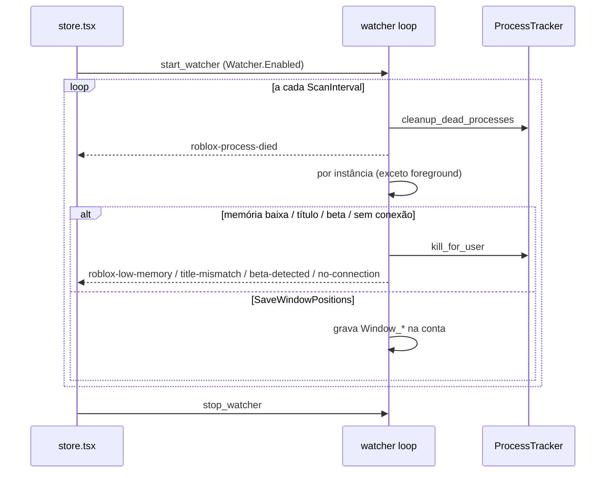

# Watcher (monitor de processos Roblox)

## Objetivo

Varredura periódica dos clientes Roblox **lançados e rastreados pelo app** para: detectar processos que morreram, fechar clientes travados/desconectados/em tela "Roblox Beta" ou com título inesperado, e salvar a posição/tamanho da janela de cada conta.

## Onde fica o código

| Arquivo | Papel |
|---|---|
| [watcher.rs](../../src-tauri/src/commands/watcher.rs) | `start_watcher` (Windows e macOS), `stop_watcher`, config `load_windows_watcher_config` |
| [client_health.rs](../../src-tauri/src/commands/client_health.rs) | Monitor de quedas: classificador do log, máquina de estados da sessão, laço de 2 s (sempre ligado no Windows) |
| [reconnect.rs](../../src-tauri/src/commands/reconnect.rs) | [Reconexão automática](#reconexão-automática) da conta que caiu, a cada passada do monitor de quedas |
| [platform/windows/tracker.rs](../../src-tauri/src/platform/windows/tracker.rs) | Sessão do watcher (`try_start_watcher`, `is_watcher_session_active`, `stop_watcher`), `cleanup_dead_processes`, `kill_for_user` |
| [platform/windows/windowing.rs](../../src-tauri/src/platform/windows/windowing.rs) | `find_main_window`, `get_window_title`, `get_window_position`, `get_process_memory_mb` (working set) |
| [store.tsx](../../src/store.tsx) | Liga/desliga conforme `Watcher.Enabled` e mostra toasts dos eventos |

## Fluxo

1. O frontend chama `start_watcher` quando `Watcher.Enabled = "true"` (e `stop_watcher` quando desliga ou no unmount).
2. `try_start_watcher` garante uma única sessão (retorna sem fazer nada se já ativa; cada start/stop incrementa o id de sessão).
3. Loop enquanto a sessão estiver ativa; a config é relida do INI a cada iteração. A cada `ScanInterval`:
   1. `cleanup_dead_processes()` → para cada conta cujo PID sumiu: evento `roblox-process-died {userId}`.
   2. Para cada instância rastreada com janela principal:
      - **Pula a janela em foreground** (a que o usuário está usando).
      - Registra o início (PID, instante) para a *startup grace* de 30 s.
      - **Não respondendo** (`CloseIfNotResponding`): o monitor de quedas diz que a janela está "Não respondendo" há 30 s ([abaixo](#não-respondendo)) → mata e emite `roblox-not-responding {userId, seconds}`.
      - **Memória** (`CloseRbxMemory`, após grace): se working set < `MemoryLowValue` MB → mata e emite `roblox-low-memory {userId, memoryMb}`.
      - **Título** (`CloseRbxWindowTitle`, após grace, título esperado não vazio): título efetivo (sem o nome da conta que o app pôs — ver [Nome da conta na janela](#nome-da-conta-na-janela)) ≠ `ExpectedWindowTitle` → mata e emite `roblox-title-mismatch {userId, title, expected}`.
      - **Beta** (`ExitOnBeta`): título contém "roblox beta" (case-insensitive) → mata e emite `roblox-beta-detected {userId, title}`.
      - **Sem conexão** (`ExitIfNoConnection`): o log do cliente diz que caiu (ver [Quedas](#quedas-lidas-do-log-do-cliente)); sem log achado, o título contém "disconnected", "connection error", "lost connection" ou "no connection" → começa a contar; se persistir ≥ `NoConnectionTimeout` s → mata e emite `roblox-no-connection {userId, title, timeout}`. Título normal zera o contador.
      - **Posição** (`SaveWindowPositions`, após grace): se (x, y, w, h) mudou desde a última gravação, salva em `Window_Position_X/Y`, `Window_Width`, `Window_Height` da conta.
4. Dorme entre 50 ms e 1 s até a próxima varredura.

## Regras de negócio

- Só age sobre processos **no tracker** (lançados pelo app com PID detectado). Clientes abertos por fora são ignorados.
- O Watcher continua sem relançar. Quem relança a conta que caiu é a [reconexão automática](#reconexão-automática), opcional e separada.
- A janela em primeiro plano nunca é avaliada (nem para kill, nem para salvar posição).
- *Startup grace* fixa de 30 s por PID vale para memória, título e posição; **não** vale para beta e sem conexão.
- A regra de memória é de **memória baixa** (cliente que caiu para um working set pequeno, típico de travado/erro), não de consumo alto.
- A ordem de avaliação é não respondendo → memória → título → beta → sem conexão → posição; o primeiro kill bem-sucedido encerra a avaliação daquela instância.
- Toda ação é `kill_for_user` (TerminateProcess + espera até 1,2 s e remove do tracker). Se o PID rastreado não for mais um processo Roblox (cliente já fechou e o Windows reutilizou o PID), `kill_for_user` não mata nada: só remove do tracker e retorna `true` (o evento correspondente ainda é emitido). O Watcher **não relança** a conta; relançar é papel do Auto Rejoin ou do usuário.
- **Todo evento do Watcher também vira linha no Console** (`emit_launch_log`, `step: "watcher"`). O evento só virava toast, que some em 2,5 s: quem voltasse depois não tinha como saber por que a conta caiu. Um teste estrutural (`watcher_console_tests`) lê o próprio arquivo e exige a linha ao lado de cada `emit` — assim cobre também o ramo de macOS, que não compila no Windows.
- As posições salvas são usadas pelo [launch único](launch.md) para restaurar a janela.
- macOS: não lê títulos; lê o log do cliente a cada `ReadInterval` ms com o mesmo classificador do Windows (`classify_log_line`: queda, expulsão e servidor fechado contam; o 285 de saída e de teleporte não) e procura o retorno para a home ("returntoluaapp: … returning from game" = beta). Não tem memória, título nem posição, nem o monitor de quedas da Sessão.

## Quedas lidas do log do cliente

Independente do Watcher (roda com ele desligado também), o **monitor de quedas**
([client_health.rs](../../src-tauri/src/commands/client_health.rs)) acompanha
cada cliente rastreado — lançado pelo app **ou** adotado do site — e diz **por
que** a conta caiu. Só lê: o log (aberto só para leitura) e a lista de processos.

- **Qual log é de qual cliente:** o mesmo casamento da varredura de clientes de
  fora (thread do cabeçalho → PID, ver [external-clients.md](external-clients.md)),
  agora num `LogLocator` usado pelos dois. Log não achado: tenta de novo a cada 10 s.
- **Leitura:** a cada 2 s, só os bytes novos, até o último fim de linha (até 8 MB
  por passada). Na primeira vez lê o log inteiro e fica com o estado do fim dele.
- **Classificador puro** (`classify_log_line`, testes `client_log_classifier_tests`):

| Linha (cliente de hoje) | Evento |
|---|---|
| `! Joining game '<job>' place <place> at <ip>` | entrou num jogo (limpa a queda) |
| `UgcExperienceController: doTeleport:` / `finishTeleportWithJoinScriptPayload` / `[FLog::SessionTransitionFSM] Teleported.` | teleporte |
| `[FLog::SingleSurfaceApp] leaveUGCGameInternal` / `[FLog::SessionTransitionFSM] Tearing down.` / `returnToLuaApp` | saída voluntária |
| `Disconnection Notification. Reason: N`, `Sending disconnect with reason: N` (0.740/0.741), `Disconnected from server for reason: Player: N (...)` (0.742), `Error Code: N` (256–299) | código de desconexão |

| Código | O que vira |
|---|---|
| 285 | **nada** — é a saída pedida pelo próprio cliente: aparece em toda saída e em todo teleporte (no 0.742, até depois do join do servidor novo) |
| 267 | expulso (`Kicked`), com a mensagem do jogo quando a linha `kicked from this experience: …` aparece |
| 274, 275 | o servidor fechou |
| 264, 273 (276 só pelos concorrentes) | caiu: a conta entrou em outro lugar |
| 277, 279, 266, 260–262 | caiu: perdeu a conexão |
| 278 | caiu: parada tempo demais |
| outro | caiu (com o código no tooltip) |

- **Teleporte não é queda:** uma queda perto (8 s) de uma linha de teleporte só
  vale se a conta não entrar no jogo novo em 8 s. Depois da saída voluntária,
  nada mais conta como queda.
- **Fechou sozinho:** o processo terminou dentro de um jogo, sem linha de saída,
  sem queda e **sem o app tê-lo fechado** (`kill_process` anota o PID —
  `was_terminated_by_app`). Sem log achado não chuta nada.
- **Histórico de sessões:** a cada passada o monitor entrega também onde cada cliente está (place, Job ID do último `Joining game`), se caiu, se saiu e se terminou (`session_snapshots`), e o histórico grava o que mudou — ver [history.md](history.md).
- **O que sai:** `health` em `get_running_instances` (Sessão e painel da conta),
  o evento `roblox-client-health` (toast) e uma linha no Console
  (`step: "client"`, ex.: "Caiu: perdeu a conexão (código 277)").
- **Exit If No Connection** passa a usar o log quando ele foi achado (queda,
  expulsão ou servidor fechado contam como sem conexão); o título da janela
  fica só de reserva para o cliente sem log (`client_connection_lost`).
- Calibrado em 09/10/2026 com os ~220 logs da máquina do dono (0.740 a 0.742):
  `client_log_real_probe` (`#[ignore]`, só leitura) não acha nenhuma queda falsa
  neles. Os logs só tinham o código 285; os outros códigos vêm do enum
  `ConnectionError` do Roblox e dos concorrentes e precisam de teste real.

## Nome da conta na janela

Também no monitor de [client_health.rs](../../src-tauri/src/commands/client_health.rs),
com o Watcher ligado ou não: cada janela de cliente rastreado (lançado pelo app
ou adotado do site — adotado quer dizer que a conta já foi identificada) ganha o
título **`<alias ou username> — Roblox`**, para saber quem é quem na barra de
tarefas. Opção `General.ShowAccountNameOnWindow` (padrão ligado, só Windows).

- **Nome primeiro** (decisão do dono, 10/10/2026): ao passar o mouse na barra
  de tarefas, o Windows corta o título no fim; com o nome na frente ele aparece
  inteiro. Até então era `Roblox — <conta>`: uma janela renomeada assim pela
  versão anterior e ainda aberta depois da atualização é reconhecida como nossa
  (`effective_client_title` aceita a ordem antiga com o nome que o app poria
  agora) e passa para a ordem nova na passada seguinte — não vira título
  estranho para as regras do Watcher. Outro texto depois de `Roblox — ` (um
  erro do Roblox, por exemplo) continua intocado.

- **Nomes ocultos:** o nome sai mascarado exatamente como a tela do app mostra
  (`mask_account_name`, espelho de `maskAccountName`; os dois lados testam os
  mesmos casos de `src/utils/accountNameCases.json`). Nome escondido nunca vai
  para a barra de tarefas.
- **Só mexe no título normal:** se a janela está com "Roblox" (ou com o título
  que o app pôs), põe o nome; se o Roblox mostra outra coisa (erro, "Roblox
  Beta"), deixa como está. O Roblox pode voltar o título para "Roblox"
  (teleporte): a cada 2 s o monitor confere e põe de novo.
- **Desligar** devolve "Roblox" às janelas renomeadas.
- **As regras do Watcher não veem o nome:** título esperado, beta e sem conexão
  comparam o título "efetivo" (`effective_client_title`: o título que o app pôs
  vale "Roblox"). Sem isso, renomear faria a regra de título fechar todos os
  clientes, e um alias como "No Connection Bob" pareceria desconexão.
- **API nativa:** `WM_SETTEXT` por `SendMessageTimeoutW` com `SMTO_ABORTIFHUNG`
  e teto de 1 s (`set_window_title` em windowing.rs) — janela travada nunca
  prende o app.
- **Limite:** se o app fechar com a opção ligada e o alias mudar antes de abrir
  de novo, o título antigo fica até o Roblox trocá-lo (o app só reconhece como
  seu o título que poria agora).

## Não respondendo

O monitor de quedas também pergunta ao Windows, a cada 2 s, se a janela de cada
cliente **que o app abriu** está travada (`IsHungAppWindow` — o Windows só diz
que sim depois de 5 s sem a janela tratar mensagens; nada é mandado para a
janela). Travada por **30 s seguidos** (`HUNG_THRESHOLD_MS`) → a Sessão e o
painel da conta mostram **"Not responding"** (âmbar), com toast e linha no
Console; some quando a janela volta a responder. Um respiro no meio zera a
contagem: carga pesada de jogo não vira aviso.

- **Cliente do site nunca é marcado** (nem fechado): o aviso e a opção são só
  para os clientes que o app abriu.
- **Fechar é opção do Watcher**, desligada por padrão: `CloseIfNotResponding`
  ("Close If Not Responding") fecha **só aquele cliente** (`kill_for_user`),
  com o Watcher ligado, pulando a janela em primeiro plano como as outras regras.
- Janela travada não tem o título mexido (nome da conta) até voltar a responder.

## Reconexão automática

[reconnect.rs](../../src-tauri/src/commands/reconnect.rs). Quando o monitor de
quedas acima diz que a conta caiu, o app reabre **só aquela conta**, no mesmo
jogo. Desligada por padrão; vale com o Watcher desligado também (o Watcher
continua sem relançar nada).

- **Onde liga:** tudo na página **Session** (desde 10/10/2026; antes ficava no
  painel de uma conta, que quem tem muitas contas não abre):
  - o **padrão de todas as contas** é `General.AutoReconnect`, "Reconnect
    accounts that drop" — no cartão "Keep accounts in game" do resumo da
    página e em Settings › General, mesmo texto, mesma setting (a página grava
    por `store.updateSetting`; a Settings relê o INI ao abrir);
  - **por conta**, uma chave pequena em cada linha da lista **In game** do
    Painel de Sessão (campo `AutoReconnect` = `true`/`false`; sem o campo, a
    conta segue o padrão e a linha diz "default"; com escolha própria aparece
    o botão de voltar ao padrão). Marcando linhas, a faixa de lote oferece
    **Reconnect on** / **Reconnect off** / **Use default**, que gravam o campo
    de cada conta marcada (`updateAccount`, uma por vez; nada abre nem fecha
    cliente). O tooltip da chave diz de onde vem o valor ("Following the
    default…" com ligado/desligado, ou escolhido para a conta).
  - O `AutoRelaunch` do Nexus também liga a conta (mesmo nome de usuário),
    mesmo com o campo em `false`. Com ele ligado (`get_nexus_accounts`, uma
    leitura para a lista toda, refeita quando muda quem está em jogo), a chave
    da linha aparece ligada e travada, com cadeado e o aviso no tooltip.
  - Desligada com uma tentativa em andamento, a linha da seção "Reconnecting"
    diz que ela para depois dessa tentativa (o backend só solta a conta fora da
    fase `launching`).
  - Só no Windows (o log do Roblox só é lido lá): fora dele não há chave nem lote.
- **Quando reconecta:** queda com motivo (perdeu a conexão, parada tempo demais,
  outro código), expulsão, servidor fechado, ou o cliente fechou sem sair do
  jogo. Só cliente **que o app abriu**: cliente do site (adotado) nunca é
  fechado nem relançado.
- **Quando não reconecta, e para de vez** (a linha fica na Sessão com o motivo):
  - **a conta entrou em outro lugar** (264/273): relançar faria as duas sessões
    se derrubarem em laço;
  - **a pessoa fechou o cliente** enquanto a reconexão esperava, ou o cliente
    relançado (processo terminou sem queda e sem o app fechá-lo). Saída
    voluntária sem queda nunca começa reconexão;
  - **conta banida/encerrada:** a 1ª tentativa pergunta de novo ao Roblox
    (`fetch_moderation`, leitura sem refresh, cache esquecido) — ban costuma
    vir logo depois de um kick; o erro de moderação do próprio launch também para;
  - **sessão expirada:** o relaunch **não renova a sessão**
    (`launch_roblox_windows(..., allow_session_refresh = false)`: ticket por
    `auth_ticket_without_refresh`); erro de sessão para em vez de deslogar a conta
    de todo lugar sem ninguém olhando;
  - a conta foi aberta fora do app, ou não se sabe para onde voltar.
- **Destino:** servidor privado/VIP → os **mesmos dados** que o app usou no
  launch (`remember_launch_target`, em memória), nunca um link inventado.
  Público → place e Job ID do último `Joining game` do log (depois de um
  teleporte, o place novo; o launch data só vai junto no mesmo place);
  servidor fechado → só o place (qualquer servidor). Sem log, o que o app pediu.
- **Espera:** 10 s, 30 s, 1 min, 2 min, 5 min (teto). Cada tentativa: confere a
  internet (HEAD em `endpoints::host("www")`; qualquer resposta HTTP conta; sem
  internet espera 10 s e confere de novo **sem gastar tentativa**), o ban, fecha
  o cliente velho **da própria conta** (só se ele não voltou ao jogo sozinho) e
  chama o launch normal pela fila (`launch_queue_start` com uma conta; fila
  ocupada por outro launch → tenta 5 s depois, sem gastar tentativa).
- **Deu certo** quando o cliente novo fica **2 min** no jogo (sem log achado:
  2 min aberto). Aí a contagem zera. Relançado que cai de novo antes, ou que
  não entra no jogo em 2 min (com log), é a próxima tentativa; **5 seguidas**
  sem ficar → "Gave up after 5 tries".
- **Voltou sozinho:** se o Roblox reconectar por conta própria (ou a pessoa
  clicar em "Reconnect"/abrir a conta de novo) enquanto a reconexão espera, ela
  é dispensada.
- **Auto Rejoin manda:** conta gerenciada pelo Auto Rejoin (sessão ativa e a
  conta na lista) não entra na reconexão; se ele assumir no meio, a reconexão sai.
- **Gravação depois da reconexão** (opcional, `Recordings.AfterReconnect`,
  padrão desligado): a conta que a reconexão relançou toca a gravação dela
  **uma vez**, só nela, depois de ficar `Recordings.AfterReconnectDelaySeconds`
  (padrão 30 s) no jogo — para voltar ao lugar do mapa. O `Relaunched` arma; a
  passada de 2 s confere o jogo pelo log do cliente novo. Ver
  [recordings.md](recordings.md#depois-da-reconexão).
- **PC acordado:** enquanto alguma conta com a opção ligada tem cliente aberto
  pelo app (ou há reconexão em andamento), o Windows não dorme
  (`General.KeepPcAwake`, ver [afk-mode.md](afk-mode.md#pc-acordado)).
- **Ao reabrir o app nada é retomado sozinho:** o estado é só em memória, e os
  clientes de antes voltam como "abertos fora do app" (adotados), que a
  reconexão não toca.
- **Na tela:** seção "Reconnecting" do Painel de Sessão ("Reconnecting in 30 s
  (attempt 2/5)", "Waiting for the internet to come back", "Reopened, checking
  it stays in the game", "Gave up after 5 tries", "Not reconnecting: …"), com
  "Try now"/"Try again" e "Stop" (nunca fecha cliente). O painel da conta não
  tem mais seção de reconexão (o topo dele ainda mostra a queda, pelo
  `ClientHealthNote`). O erro da última tentativa vai numa **segunda linha**
  embaixo do estado (não só no tooltip), traduzido: as frases que o backend
  escreve são as constantes `RECONNECT_ERROR_*` de reconnect.rs, traduzidas
  por `reconnectErrorText` (src/utils/autoReconnect.ts — o teste lê a lista do
  fonte do Rust; erro do launch passa como veio). Enquanto um botão roda, os
  da linha ficam desabilitados; o X esconde a linha na hora (volta se o
  comando falhar; outra queda da mesma conta aparece de novo); `false` do
  backend (a conta já saiu da reconexão) vira um aviso curto. Toasts:
  "Auto-reconnect (conta) — estado" e, para a queda, "conta in Roblox —
  motivo" (sem dois-pontos em dobro). Evento `auto-reconnect` (`{entries, reconnected}`),
  comandos `get_auto_reconnect_status`, `stop_auto_reconnect`,
  `retry_auto_reconnect`; linhas no Console com `step: "reconnect"`.
- Testes: `auto_reconnect_tests` (máquina de estados) e
  `auto_reconnect_target_tests` (destino e internet).

## Teto de memória

[memory_ceiling.rs](../../src-tauri/src/commands/memory_ceiling.rs) e
[platform/windows/memory_trim.rs](../../src-tauri/src/platform/windows/memory_trim.rs).
Pacote **Conforto** (ver [plano-ideias.md](../plano-ideias.md)). O contrário da
regra de memória baixa do Watcher: um cliente **que o app abriu** passou de um
limite de memória — em vez de fechar, o app primeiro pede ao Windows para tirar
da RAM o que o cliente não está usando agora (as páginas vão para o arquivo de
paginação e voltam quando o cliente precisar; nada é perdido).

- **Nas duas edições** (feature `memory-trim` do Cargo, dentro do `standard`):
  é uma API nativa nova no binário (`K32EmptyWorkingSet`, do kernel32, a mesma
  família do `K32GetProcessMemoryInfo` que o Watcher já usa), chamada só de
  `trim_working_set`. Começou só na completa e passou para a padrão depois de o
  exe padrão com ela sair limpo no Defender e no VirusTotal (11/10/2026).
  `supportsMemoryTrim` nas capacidades diz à tela; sem a feature, nada do teto
  aparece e a passada não faz nada.
- **O limite:** padrão de todas as contas em `Optimization.MemoryLimit` (MB, `0`
  ou vazio = sem limite, **desligado por padrão**) e, por conta, o campo
  `MemoryLimit` (`0` = sem limite para esta conta; sem o campo, segue o padrão).
  Limite aceito entre 256 MB e 64 GB (`parse_memory_limit`, espelhado em
  `src/utils/memoryLimit.ts`). **A escolha da linha é gravada no campo da conta**
  (decisão deste pacote): vale na passada seguinte (2 s), sem relançar, e também
  nos próximos launches da conta.
- **Onde se muda:**
  - **por cliente, na página Session** — cada linha da lista **In game** mostra a
    memória do cliente agora (do mesmo polling de 2,5 s do `get_running_instances`,
    sem leitura nova) e um seletor compacto: "Default (…)", "No limit", 1 / 1,5 /
    2 / 3 / 4 GB, o valor próprio da conta e "Custom…" (pergunta em MB ou GB). A
    memória fica âmbar acima do limite, com o tooltip dizendo que o app pediu para
    liberar. Com linhas marcadas, a faixa **Memory limit** aplica o mesmo valor a
    todas as marcadas (ou volta ao padrão), uma conta por vez. Cliente aberto pelo
    site não tem seletor nem entra no lote;
  - **o padrão** — no cartão "Memory limit" do resumo da página Session e em
    Settings › Optimization › "While you play" ("Memory limit per client"),
    mesma setting.
- **Quando age** (`memory_ceiling_step`, a cada 2 s no laço do monitor de quedas,
  funciona **com o Watcher desligado também**):
  1. cliente aberto há menos de 30 s: nada (carregando, a memória sobe e desce);
  2. a janela que a pessoa está usando agora: nada (liberar a memória do jogo em
     uso dá engasgo); o estado fica como estava;
  3. acima do limite pela primeira vez: **libera** (linha no Console, `step:
     "memory"`: "Memória em 2500 MB, acima do limite de 2048 MB: pedi ao Windows
     para liberar");
  4. voltou para baixo: zera — uma subida mais tarde libera de novo, não fecha;
  5. ainda acima **60 s depois** de liberar: **fecha só se** o Watcher estiver
     ligado (`Watcher.Enabled`) **e** a opção de fechar por memória dele
     (`Watcher.CloseRbxMemory`, "Close If Memory Low") também — é a mesma opção
     que já fechava por memória baixa, e a descrição dela diz isso agora. Fecha
     pelo `kill_for_user` do Watcher (só aquele cliente), com toast "Closed …:
     memory stayed over its limit after it was freed" (evento
     `roblox-memory-limit`) e linha no Console;
  6. sem a opção de fechar: libera de novo a cada minuto, e nunca fecha.
- **Nunca toca** cliente aberto pelo site (adotado), cliente de outra conta, nem
  PID que não é mais do cliente rastreado (o fechar é o `kill_for_user`, que
  confere se o PID ainda é um Roblox).
- Testes: `memory_ceiling_tests` (limite da conta x padrão, `0`/off, faixa,
  carência, liberar → esperar → fechar, sem a opção de fechar, voltar para baixo,
  janela em uso, monitor com dublê do sistema, PID novo da mesma conta, linha do
  Console, visão em camelCase), `win_memory_trim_tests` (PID 0, API só no
  `memory_trim.rs` e atrás da feature), `platform_info_tests`
  (`supportsMemoryTrim`), `memoryLimit.test.ts`, `SessionPanel.test.tsx`
  ("limite de memória por cliente": seletor, campo gravado, padrão, custom, âmbar,
  site sem seletor, sem a feature, lote), `SessionPage.test.tsx` e
  `settingsTabs.test.tsx` (o padrão).

## Configurações relacionadas

Seção `[Watcher]`:

| Chave | Default | Clamp | Efeito |
|---|---|---|---|
| `Enabled` | `false` | — | Frontend inicia/para o watcher |
| `ScanInterval` | `6` (s) | 1–3600 | Intervalo de varredura |
| `ReadInterval` | `250` (ms) | 50–60000 | Só macOS: leitura de logs |
| `CloseRbxMemory` | `false` | — | Liga a regra de memória baixa; com o [teto de memória](#teto-de-memória), também fecha o cliente que continua acima do limite depois de liberar |
| `MemoryLowValue` | `200` (MB) | 1–16384 | Limite inferior de working set |
| `CloseRbxWindowTitle` | `false` | — | Liga a regra de título |
| `ExpectedWindowTitle` | `Roblox` | — | Título esperado exato |
| `ExitOnBeta` | `false` | — | Fecha clientes com "Roblox Beta" no título |
| `CloseIfNotResponding` | `false` | — | Fecha o cliente do app que fica "Não respondendo" por 30 s |
| `ExitIfNoConnection` | `false` | — | Fecha clientes desconectados |
| `NoConnectionTimeout` | `60` (s) | 1–3600 | Tempo desconectado antes de fechar |
| `SaveWindowPositions` | `false` | — | Persiste posição/tamanho por conta |

## Armadilhas / cuidados

- `ExpectedWindowTitle` é comparação **exata** (com o título efetivo: o nome da conta que o app põe não conta); qualquer outra variação (idioma, sufixo) mata o cliente após 30 s.
- `MemoryLowValue` alto demais mata clientes saudáveis que ainda estão carregando após a grace.
- A detecção de desconexão depende do formato do log do Roblox (e, sem log, do título da janela), que pode mudar entre versões: o 0.742 já trocou as linhas de desconexão. Se uma atualização mudar de novo, rode `client_log_real_probe` contra os logs novos.
- Salvar posição escreve no arquivo de contas (encriptado) sempre que a janela se move; com muitas contas isso gera várias gravações.
- O loop relê settings a cada iteração, então mudanças no INI valem sem reiniciar, mas `Enabled` é controlado pelo frontend.
